# &nbsp;&nbsp;SURGE

[](https://github.com/S-Villar/SURGE/actions/workflows/ci.yml)
[](./LICENSE)
[](./pyproject.toml)
[](https://github.com/astral-sh/ruff)
[](docs/GETTING_STARTED.md)
[](https://www.osti.gov/doecode/biblio/179819)
[](https://doi.org/10.11578/dc.20260422.5)

**Surrogate Unified Robust Generation Engine** — train, tune, evaluate, and
export scientific surrogate models from a single declarative workflow.
One YAML spec (or Python API) covers
**load → schema → split → train → HPO → metrics → UQ → artifacts → figures**,
with every run reproducible from its own `runs/<tag>/` directory.

**v0.1.0** · [DOE CODE 179819](https://www.osti.gov/doecode/biblio/179819) ·
[DOI 10.11578/dc.20260422.5](https://doi.org/10.11578/dc.20260422.5)

<p align="center">
  <picture><source media="(prefers-color-scheme: dark)" srcset="docs/assets/readme/dark/architecture.png">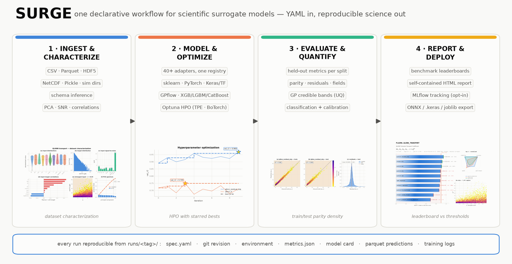</picture>
</p>
<p align="center"><sub><em>The workflow by functionality — every thumbnail is a
real SURGE output, regenerated from run artifacts
(<code>python scripts/make_architecture_poster.py</code>).</em></sub></p>

---

## Why SURGE

- **One workflow, many sciences.** Tabular scalars, multi-output targets,
  1D/2D fields, sequences, and images move through the same pipeline —
  models plug in through a registry, not through per-project scripts.
- **40+ registered model adapters across four ML backends** —
  **scikit-learn** (RF, GBM, ridge, logistic, GPR), boosted trees
  (**XGBoost / LightGBM / CatBoost**), **PyTorch** (MLP families,
  FNO / DeepONet / U-Net operator learners, LSTM/GRU,
  CNN/ResNet/ViT vision, KAN, FT-Transformer, VAE/DDPM/CGAN),
  **TensorFlow/Keras** (`keras.mlp`, or **bring your own compiled
  `tf.keras` model** via `build_fn`), and Gaussian processes with
  predictive uncertainty (sklearn GPR, BoTorch exact/sparse, GPflow).
- **Mix backends in one workflow**: a single YAML spec can train a
  random forest, a PyTorch residual MLP, and a Keras network side by
  side on the same splits — same metrics, same artifacts, directly
  comparable.
- **Automated HPO** (Optuna TPE / BoTorch) with per-epoch training logs
  and starred-best convergence plots.
- **Deployment path**: trained PyTorch surrogates export to **ONNX**
  with `onnxruntime` numeric-parity tests in CI — the route used for
  real-time inference in the ICRF surrogate publications; Keras models
  serialize to the portable `.keras` format, sklearn to joblib.
- **Benchmarks with receipts** (the *model-bench* suite): 30+ curated
  benchmarks from UCI/OpenML to PDEBench, TheWell, MNIST/CIFAR-10, and
  fusion datasets (QLKNN transport, ConStellaration stellarator design),
  each with citation, threshold, and machine-readable results.
- **Provenance by default**: every run stores its spec, git revision,
  environment snapshot, scalers, per-split parquet predictions, and a
  model card.
- **Publication-grade output**: a single visual system produces
  deterministic PNG/SVG/PDF figures (light + dark) and a self-contained
  HTML leaderboard — no server, works on HPC over `scp`.

## Model benchmarking

Every registered model can be scored against the curated benchmark
suite — repeated seeds, mean ± std, runtime, and published pass
thresholds with citations:

<p align="center">
  <picture><source media="(prefers-color-scheme: dark)" srcset="docs/assets/readme/dark/leaderboard.png"></picture>
</p>
<p align="center"><sub><em>QLKNN ITG heat-flux transport: ten models over
repeated seeds — the HPO-tuned residual MLP leads at R² 0.948 ± 0.003
against the published 0.90 gate.</em></sub></p>

```bash
surge bench -b plasma.qlknn_transport -m all --seeds 3   # the row above
surge report --out leaderboard.html                      # full dashboard
```

The HTML dashboard adds spider charts per capability domain,
per-benchmark **dataset previews** (sample MNIST digits, Lorenz
attractor trajectories, Burgers field pairs), citations, tiers, and
sortable tables — generated exclusively from
`benchmark_reports/**/result.json` artifacts, never hand-entered.

## Scientific results at a glance

**2D operator learning** — FNO-2D learns the periodic Poisson solver
source→solution at median rel-L2 **0.006** (32×32 fields; U-Net covers the
same task shape):

| | | |
|:---:|:---:|:---:|
| <picture><source media="(prefers-color-scheme: dark)" srcset="docs/assets/readme/dark/field2d_truth.png">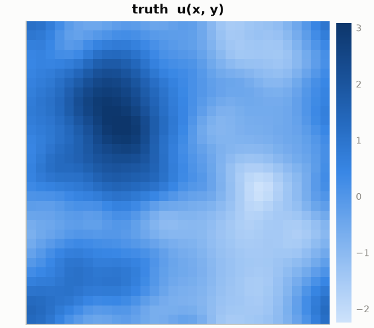</picture> | <picture><source media="(prefers-color-scheme: dark)" srcset="docs/assets/readme/dark/field2d_prediction.png">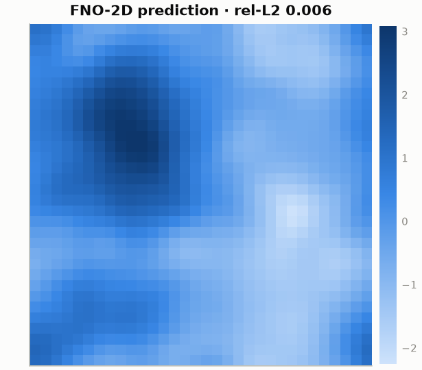</picture> | <picture><source media="(prefers-color-scheme: dark)" srcset="docs/assets/readme/dark/field2d_error.png">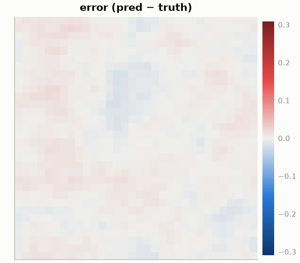</picture> |

**External PDE benchmark — [TheWell](https://polymathic-ai.org/the_well/)
Gray-Scott reaction–diffusion** (Ohana et al., NeurIPS 2024). Forecast the
species-B field **160 stored steps ahead** — the horizon is chosen so that
the *persistence* baseline ("predict no change", green bar) visibly fails,
because at single-step the task is trivial (persistence rel-L2 0.002 beats
every model). Seven registry surrogates, one script
([`examples/thewell_grayscott_study.py`](examples/thewell_grayscott_study.py)):
**U-Net (residual target) leads at median rel-L2 0.206** and is the only
architecture that beats persistence (0.265); FNO-2D blurs the sharp Turing
interfaces at this horizon (0.428 even with 24 modes + residual target), and
DeepONet's global low-rank basis can't localize (0.554):

<p align="center">
  <picture><source media="(prefers-color-scheme: dark)" srcset="docs/assets/readme/dark/thewell_grayscott.png"></picture>
</p>

<details>
<summary><b>The single-step task also exists</b> (<code>--horizon 1</code>) — and shows why the forecast horizon matters: every model, even residual DeepONet at 0.020, loses to persistence at 0.002. Click to see it.</summary>
<p align="center">
  <picture><source media="(prefers-color-scheme: dark)" srcset="docs/assets/readme/dark/thewell_grayscott_h1.png">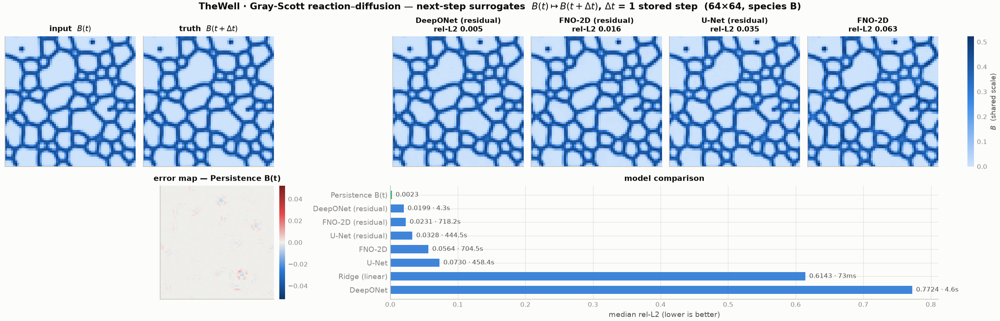</picture>
</p>
</details>

**Plasma-transport regression** (QLKNN ITG heat flux) — HPO-tuned residual
MLP, log-density parity in the style of the ICRF surrogate papers:

| | | |
|:---:|:---:|:---:|
| <picture><source media="(prefers-color-scheme: dark)" srcset="docs/assets/readme/dark/parity_train.png">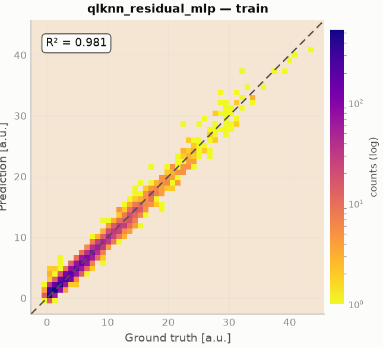</picture> | <picture><source media="(prefers-color-scheme: dark)" srcset="docs/assets/readme/dark/parity_test.png">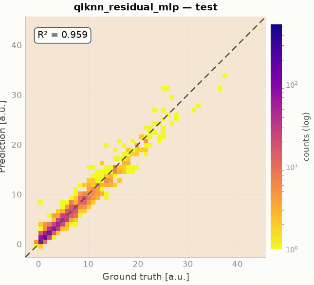</picture> | <picture><source media="(prefers-color-scheme: dark)" srcset="docs/assets/readme/dark/parity_residuals.png">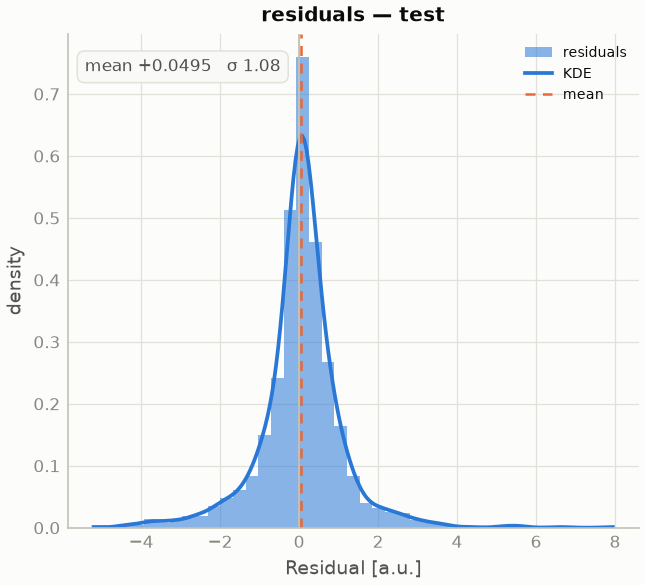</picture> |

**Stellarator design surrogate — ConStellaration** (Proxima Fusion ×
Hugging Face; Goodman et al. 2025, [arXiv:2506.19583](https://arxiv.org/abs/2506.19583)).
One residual MLP maps the plasma boundary Fourier coefficients
$(R_{mn}, Z_{mn})$ to **12 equilibrium figures of merit** for 26,897
QI-like configurations — quasi-isodynamic quality at R² **0.93**, and real
rotating boundary cross-sections, not toy shapes:

<p align="center">
  <picture><source media="(prefers-color-scheme: dark)" srcset="docs/assets/readme/dark/constellaration.png"></picture>
</p>

```bash
surge bench -b plasma.constellaration -m pytorch.residual_mlp --seeds 3
```

**Optimization, uncertainty, and monitoring**:

| | | |
|:---:|:---:|:---:|
| <picture><source media="(prefers-color-scheme: dark)" srcset="docs/assets/readme/dark/hpo_convergence.png">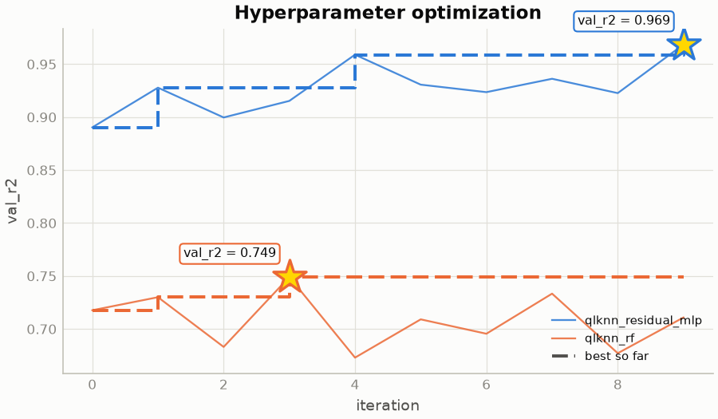</picture> | <picture><source media="(prefers-color-scheme: dark)" srcset="docs/assets/readme/dark/uncertainty.png">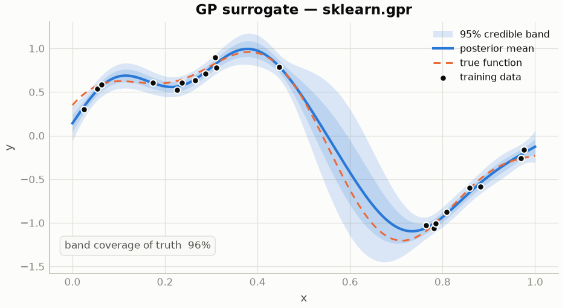</picture> | <picture><source media="(prefers-color-scheme: dark)" srcset="docs/assets/readme/dark/training_curves.png">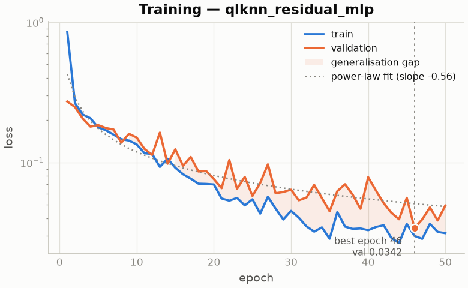</picture> |
| *Optuna HPO: per-trial traces, running best, gold-starred optima.* | *GP credible bands widen where data is absent (96% truth coverage).* | *Per-epoch monitoring with **smoothed early stopping** — training halts itself at true saturation (epoch 147/300).* |

**Deep-ensemble uncertainty** (`pytorch.mlp_ensemble`) — mean ± 2σ
predictions and honest calibration: raw spread is overconfident; σ-rescaling
on a held-out split recovers near-Gaussian coverage:

<p align="center">
  <picture><source media="(prefers-color-scheme: dark)" srcset="docs/assets/readme/dark/ensemble.png"></picture>
</p>

Regenerate everything above from your own runs — full gallery per
problem type in [`docs/gallery.md`](docs/gallery.md):

```bash
python examples/viz_theme_gallery.py                      # figures, light+dark
surge report --out leaderboard.html                       # interactive dashboard
```

---

## Install

**Requirements:** Python **3.10 – 3.12**. Package name: **`surge-ml`** ·
import name: **`surge`**.

With [uv](https://docs.astral.sh/uv/) (recommended):

```bash
git clone https://github.com/S-Villar/SURGE.git && cd SURGE
uv venv && source .venv/bin/activate
uv pip install -e ".[torch,dev]"
surge version && surge models
```

With plain pip: `python3.11 -m venv .venv && source .venv/bin/activate &&
pip install -e ".[torch,dev]"`.

> PyPI release of `surge-ml` is prepared (`uv build` produces clean
> artifacts — see [`docs/RELEASING.md`](docs/RELEASING.md)); until it is
> published, install from the repository as above.

| Extra | Adds | Install |
|-------|------|---------|
| *(base)* | sklearn, pandas, Optuna, plotting | `pip install -e .` |
| `torch` | PyTorch model families | `pip install -e ".[torch]"` |
| `onnx` | ONNX export + runtime parity tests | `pip install -e ".[onnx]"` |
| `benchmarks` | h5py, Optuna for the benchmark suite | `pip install -e ".[benchmarks]"` |
| `tensorflow` | TF ≥ 2.21 + tf-keras → `keras.mlp` adapter | `pip install -e ".[tensorflow]"` |
| `gpflow` | TF stack for GPflow GPs (then `pip install gpflow --no-deps`) | `pip install -e ".[gpflow]"` |
| `shap` | SHAP feature importance (NumPy-2 compatible) | `pip install -e ".[shap]"` |
| `dev` | pytest, ruff, h5py | `pip install -e ".[dev]"` |

---

## Try it — copy-paste examples

All runs write artifacts to `runs/<tag>/` (`metrics.json`, trained models,
scalers, predictions, spec snapshot).

### 1 · Smoke test (~5 s) — tabular regression

```bash
python -m examples.quickstart --dataset diabetes --model rf --infer
python -c "import json; print(json.load(open('runs/diabetes_rf/metrics.json'))['sklearn.random_forest']['test'])"
```

### 2 · Neural net + HPO (~1–2 min CPU)

```bash
python -m examples.quickstart --dataset california --model mlp --n-trials 5 --infer
```

### 3 · Scientific case — QLKNN plasma transport, two models, HPO

Predict **electron ITG heat flux** (`efeITG`) from 10 gyrokinetic inputs;
one workflow trains **Random Forest + Residual MLP**, each with its own
Optuna search (first run generates the dataset via `fusion_surrogates`):

```bash
pip install fusion_surrogates
python examples/qlknn_multi_hpo_workflow.py --hpo-trials 10 --overwrite
```

### 4 · Mix backends in one spec — sklearn vs PyTorch vs Keras

One YAML, three frameworks, identical splits and metrics:

```yaml
# multi_backend.yaml
dataset_path: my_data.csv
models:
  - key: sklearn.random_forest
  - key: pytorch.residual_mlp
    hpo: {n_trials: 20, metric: val_rmse}
  - key: keras.mlp                      # needs the [tensorflow] extra
    params: {hidden_layers: [64, 64], epochs: 200}
run_tag: backend_shootout
```

```bash
surge run multi_backend.yaml
```

`metrics.json` then holds train/val/test scores for all three on the
same data — and any compiled `tf.keras` architecture of your own plugs
in through the `build_fn` parameter of `keras.mlp` (see
`surge/model/adapters/keras.py`), just as custom PyTorch models plug in
via `examples/custom_cnn_adapter_template.py`. Live example on the
QLKNN transport task — three backends through one registry, and the
small-data regime is exactly where the Gaussian process earns its keep:

| | | |
|:---:|:---:|:---:|
| <picture><source media="(prefers-color-scheme: dark)" srcset="docs/assets/readme/dark/trio_random_forest.png">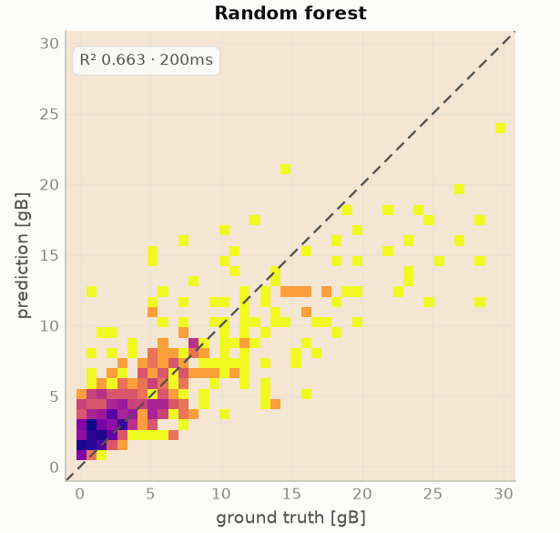</picture> | <picture><source media="(prefers-color-scheme: dark)" srcset="docs/assets/readme/dark/trio_pytorch_mlp.png">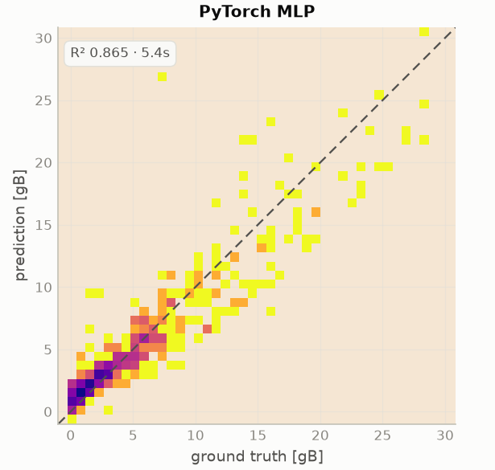</picture> | <picture><source media="(prefers-color-scheme: dark)" srcset="docs/assets/readme/dark/trio_gaussian_process.png">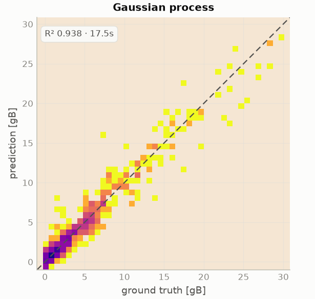</picture> |

### 5 · Your own CSV / Parquet / PKL / HDF5 / NetCDF file

```bash
python examples/custom_dataset_tutorial.py
python examples/run_workflow.py --spec examples/configs/custom_dataset_tutorial.yaml
```

Full guide: [`docs/BUILD_YOUR_OWN_SURROGATE.md`](docs/BUILD_YOUR_OWN_SURROGATE.md)

### 6 · Benchmarks

```bash
surge-benchmark --list                                        # 30+ curated benchmarks
surge-benchmark -b synthetic.regression_1d -m sklearn.random_forest --no-save
surge-benchmark -b tabular.california_housing -m all --seeds 5   # leaderboard, mean±std
surge-benchmark -b pde.burgers_1d --compare-models pytorch.fno1d,pytorch.residual_mlp
```

Verify the install any time:

```bash
pytest -q tests/test_e2e_release_smoke.py   # fast smoke (~seconds)
pytest -q                                   # full suite
```

---

## What you get after a run

```text
runs/<tag>/
├── metrics.json              # train / val / test metrics per model
├── workflow_summary.json     # full run summary + resources + profiling
├── spec.yaml                 # exact config (re-runnable)
├── git_rev.txt, env.txt      # provenance
├── model_card_<model>.json   # data + model provenance card
├── scalers/inputs.joblib
├── models/<name>.joblib|pt
├── predictions/              # parquet per split (y_true / y_pred)
├── training_log_*.jsonl      # per-epoch losses (neural backends)
├── hpo/                      # Optuna trial logs (*_hpo.json)
└── plots/                    # parity, HPO convergence, training dashboards
```

ONNX export (`pip install -e ".[onnx]"`) round-trips PyTorch surrogates
through `onnxruntime` with numeric-parity tests — the path used for
real-time inference deployments.

---

## Visualization system

`surge.viz.theme` is the single source of visual truth: a colorblind-validated
palette (light **and** dark), the signature reversed-plasma density style for
parity plots, reserved status colors for PASS/FAIL, and deterministic
PNG/SVG/PDF export (byte-stable across re-renders, CI-diffable).

```python
from surge.viz.theme import surge_theme, save_figure

with surge_theme("dark") as palette:
    fig, ax = plt.subplots()
    ax.plot(epochs, loss)           # series colors applied automatically
save_figure(fig, "loss")            # loss.png + loss.svg + loss.pdf
```

Per-run figures: `from surge.viz import viz_run; viz_run(Path("runs/<tag>"))`.
Gallery of every figure type: `python examples/viz_theme_gallery.py`.

---

## Run monitoring — mission control

Every HPO campaign leaves machine-readable artifacts (per-trial training
histories, the trials manifest, metrics, parquet predictions), and the
gallery renders them as a one-look dashboard — here the QLKNN residual-MLP
campaign: all trial loss curves with the winner highlighted, search
convergence with the starred best, parameter sensitivity, and the tuned
model's test parity:

<p align="center">
  <picture><source media="(prefers-color-scheme: dark)" srcset="docs/assets/readme/dark/mission_control.png">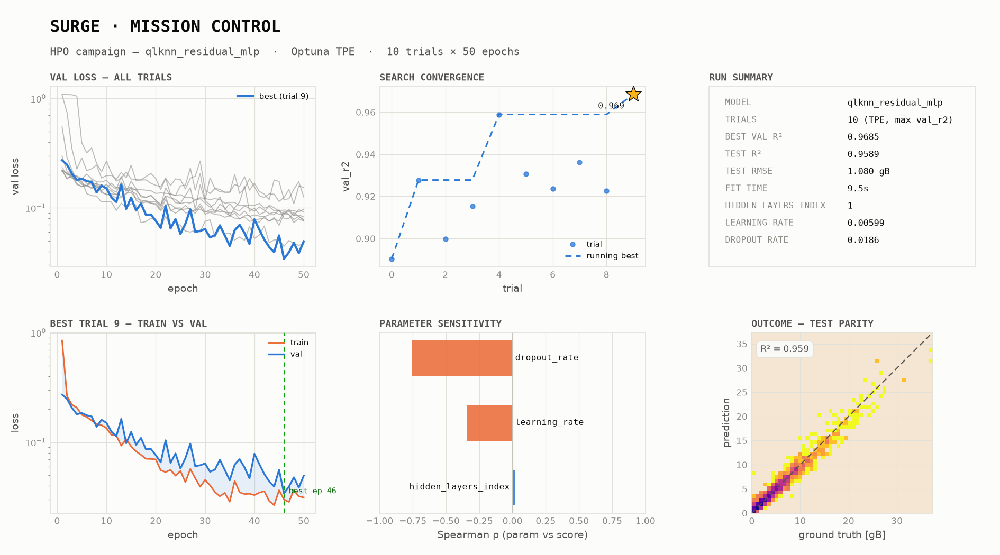</picture>
</p>

```bash
python examples/viz_theme_gallery.py --only mission_control --hpo-run runs/qlknn_multi_hpo
```

## Experiment tracking (MLflow)

Every run's parameters, per-model metrics, and artifacts can be mirrored
to [MLflow](https://mlflow.org) — opt-in, no server required for local
file/sqlite backends:

```yaml
# in any workflow spec
mlflow_tracking: true
mlflow_experiment: my-campaign
```

```bash
surge bench -b tabular.california_housing -m all --mlflow   # benchmarks too
python -c "from surge.integrations.mlflow_logger import log_surge_run; \
from pathlib import Path; log_surge_run(Path('runs/qlknn_multi_hpo'))"
```

<p align="center">
  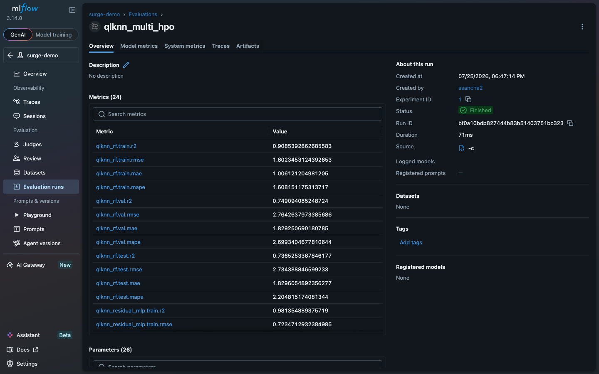
</p>
<p align="center"><sub><em>A real SURGE run in the MLflow UI — per-model
train/val/test metrics, parameters, and run artifacts.</em></sub></p>

HPO campaigns are logged as **nested runs**: the parent run links its
trials, and every trial streams its per-epoch `train_loss` / `val_loss`
so the MLflow chart view plots live loss curves per trial:

<p align="center">
  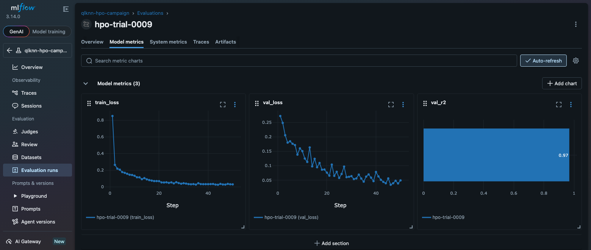
</p>

## Documentation

| Topic | Link |
|-------|------|
| **Getting started (one page)** | [`docs/GETTING_STARTED.md`](docs/GETTING_STARTED.md) |
| Build your own surrogate | [`docs/BUILD_YOUR_OWN_SURROGATE.md`](docs/BUILD_YOUR_OWN_SURROGATE.md) |
| First-run walkthrough (HPC) | [`docs/setup/WALKTHROUGH.md`](docs/setup/WALKTHROUGH.md) |
| Install reference | [`docs/setup/INSTALLATION.md`](docs/setup/INSTALLATION.md) |
| Codebase tour | [`docs/SURGE_OVERVIEW.md`](docs/SURGE_OVERVIEW.md) |
| Benchmark definitions & citations | [`docs/BENCHMARK_VERIFICATION_BRIEF.md`](docs/BENCHMARK_VERIFICATION_BRIEF.md) |
| Architecture roadmap | [`docs/design/ARCHITECTURE_RECOMMENDATIONS.md`](docs/design/ARCHITECTURE_RECOMMENDATIONS.md) |
| Doc index | [`docs/README.md`](docs/README.md) |

## SURGE in publications

The methodology and figure conventions above come from peer-reviewed
surrogate-modeling work by the SURGE authors:

- Á. Sánchez-Villar *et al.*, *Real-time capable modeling of ICRF heating
  on NSTX-U and WEST via machine-learning approaches*, **Nuclear Fusion**.
- Á. Sánchez-Villar *et al.*, *Automated ICRF-heating surrogate modeling
  via machine learning*, **EPJ Web of Conferences** (RF Power in Plasmas,
  2026), art. 01005 —
  [epj-conferences.org](https://www.epj-conferences.org/articles/epjconf/abs/2026/02/epjconf_rfppc2026_01005/epjconf_rfppc2026_01005.html).

Software citation: [DOE CODE 179819](https://www.osti.gov/doecode/biblio/179819),
DOI [10.11578/dc.20260422.5](https://doi.org/10.11578/dc.20260422.5),
[`CITATION.cff`](CITATION.cff).

---

## Community

- **Issues:** `.github/ISSUE_TEMPLATE/`
- **Security:** [`SECURITY.md`](SECURITY.md) (private channel — not public issues)
- **Contributing:** [`CONTRIBUTING.md`](CONTRIBUTING.md)
- **Cite:** [DOE CODE 179819](https://www.osti.gov/doecode/biblio/179819),
  DOI [10.11578/dc.20260422.5](https://doi.org/10.11578/dc.20260422.5),
  [`CITATION.cff`](CITATION.cff)

<p align="center">
  
</p>

## License

BSD 3-Clause — see [`LICENSE`](LICENSE) and [`NOTICE`](NOTICE).
