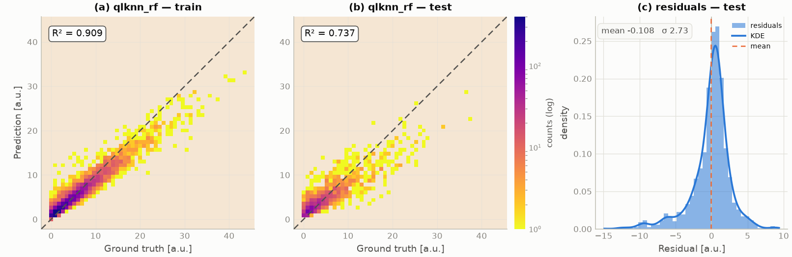
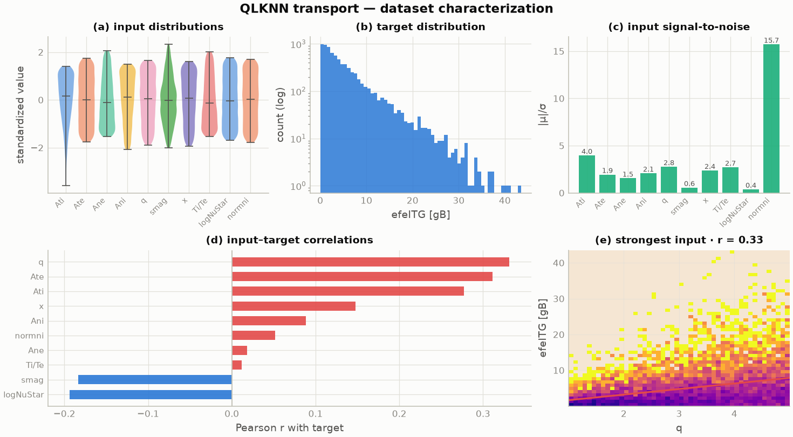

# &nbsp;&nbsp;SURGE

[](https://github.com/S-Villar/SURGE/actions/workflows/ci.yml)
[](./LICENSE)
[](./pyproject.toml)
[](https://github.com/astral-sh/ruff)
[](https://www.osti.gov/doecode/biblio/179819)
[](https://doi.org/10.11578/dc.20260422.5)

**Surrogate Unified Robust Generation Engine** — train, tune, evaluate, and
export scientific surrogate models from a single declarative workflow.
One YAML spec (or Python API) covers
**load → schema → split → train → HPO → metrics → UQ → artifacts → figures**,
with every run reproducible from its own `runs/<tag>/` directory.

**v0.1.0** · [DOE CODE 179819](https://www.osti.gov/doecode/biblio/179819) ·
[DOI 10.11578/dc.20260422.5](https://doi.org/10.11578/dc.20260422.5)

<p align="center">
  
</p>
<p align="center"><sub><em>Operator learning on viscous Burgers' equation
(residual MLP via the SURGE registry): sample fits, signed-error field over
the test set, and per-sample error distribution — every figure generated
from run artifacts, never hand-assembled.</em></sub></p>

---

## Why SURGE

- **One workflow, many sciences.** Tabular scalars, multi-output targets,
  1D/2D fields, sequences, and images move through the same pipeline —
  models plug in through a registry, not through per-project scripts.
- **40 registered model adapters**: scikit-learn baselines and GBMs
  (XGBoost / LightGBM / CatBoost), PyTorch MLP families, FNO / DeepONet /
  U-Net operator learners, LSTM/GRU, CNN/ResNet/ViT vision models,
  KAN and FT-Transformer, Gaussian processes (sklearn, BoTorch) with
  predictive uncertainty.
- **Automated HPO** (Optuna TPE / BoTorch) with per-epoch training logs
  and starred-best convergence plots.
- **Benchmarks with receipts**: 30+ curated benchmarks from UCI/OpenML to
  PDEBench, TheWell, MNIST/CIFAR-10, and fusion datasets (QLKNN transport,
  ConStellaration stellarator design), each with citation, threshold, and
  machine-readable results.
- **Provenance by default**: every run stores its spec, git revision,
  environment snapshot, scalers, per-split parquet predictions, and a
  model card.
- **Publication-grade output**: a single visual system produces
  deterministic PNG/SVG/PDF figures (light + dark) and a self-contained
  HTML leaderboard — no server, works on HPC over `scp`.

## Scientific results at a glance

| | |
|:---:|:---:|
|  |  |
| *Regression parity (QLKNN ITG heat-flux surrogate): log-scaled density, R² 0.91 train / 0.74 test for the RF baseline — the HPO-tuned residual MLP reaches 0.96 test.* | *Optuna HPO across models: per-trial traces, running best, gold star at each optimum.* |
|  |  |
| *Gaussian-process surrogate with 68/95% credible bands — the band widens where training data is absent (96% truth coverage).* | *Pre-training dataset characterization: distributions, signal-to-noise, input–target correlations.* |

Regenerate everything above from your own runs:

```bash
python examples/viz_theme_gallery.py                      # figures, light+dark
python -m surge.report.leaderboard --out leaderboard.html # interactive dashboard
```

The leaderboard dashboard embeds per-benchmark **dataset previews**
(sample MNIST digits, Lorenz attractor trajectories, Burgers field pairs),
citations, tiers, pass/fail gates, and sortable model tables — generated
exclusively from `benchmark_reports/**/result.json` artifacts.

---

## Install

**Requirements:** Python **3.10 or 3.11** (recommended: 3.11).

PyPI package name: **`surge-ml`** · import name: **`surge`**

```bash
git clone https://github.com/S-Villar/SURGE.git
cd SURGE
python3.11 -m venv .venv && source .venv/bin/activate
pip install -e ".[torch,dev]"
python -c "import surge; print('surge', surge.__version__)"
```

Or from PyPI: `pip install "surge-ml[torch,dev]"` (clone the repo for the
`examples/` used below).

| Extra | Adds | Install |
|-------|------|---------|
| *(base)* | sklearn, pandas, Optuna, plotting | `pip install -e .` |
| `torch` | PyTorch model families | `pip install -e ".[torch]"` |
| `onnx` | ONNX export + runtime parity tests | `pip install -e ".[onnx]"` |
| `benchmarks` | h5py, Optuna for the benchmark suite | `pip install -e ".[benchmarks]"` |
| `dev` | pytest, ruff, h5py | `pip install -e ".[dev]"` |

---

## Try it — copy-paste examples

All runs write artifacts to `runs/<tag>/` (`metrics.json`, trained models,
scalers, predictions, spec snapshot).

### 1 · Smoke test (~5 s) — tabular regression

```bash
python -m examples.quickstart --dataset diabetes --model rf --infer
python -c "import json; print(json.load(open('runs/diabetes_rf/metrics.json'))['sklearn.random_forest']['test'])"
```

### 2 · Neural net + HPO (~1–2 min CPU)

```bash
python -m examples.quickstart --dataset california --model mlp --n-trials 5 --infer
```

### 3 · Scientific case — QLKNN plasma transport, two models, HPO

Predict **electron ITG heat flux** (`efeITG`) from 10 gyrokinetic inputs;
one workflow trains **Random Forest + Residual MLP**, each with its own
Optuna search (first run generates the dataset via `fusion_surrogates`):

```bash
pip install fusion_surrogates
python examples/qlknn_multi_hpo_workflow.py --hpo-trials 10 --overwrite
```

### 4 · Your own CSV / Parquet / PKL / HDF5 / NetCDF file

```bash
python examples/custom_dataset_tutorial.py
python examples/run_workflow.py --spec examples/configs/custom_dataset_tutorial.yaml
```

Full guide: [`docs/BUILD_YOUR_OWN_SURROGATE.md`](docs/BUILD_YOUR_OWN_SURROGATE.md)

### 5 · Benchmarks

```bash
surge-benchmark --list                                        # 30+ curated benchmarks
surge-benchmark -b synthetic.regression_1d -m sklearn.random_forest --no-save
surge-benchmark -b tabular.california_housing -m all --seeds 5   # leaderboard, mean±std
surge-benchmark -b pde.burgers_1d --compare-models pytorch.fno1d,pytorch.residual_mlp
```

Verify the install any time:

```bash
pytest -q tests/test_e2e_release_smoke.py   # fast smoke (~seconds)
pytest -q                                   # full suite
```

---

## What you get after a run

```text
runs/<tag>/
├── metrics.json              # train / val / test metrics per model
├── workflow_summary.json     # full run summary + resources + profiling
├── spec.yaml                 # exact config (re-runnable)
├── git_rev.txt, env.txt      # provenance
├── model_card_<model>.json   # data + model provenance card
├── scalers/inputs.joblib
├── models/<name>.joblib|pt
├── predictions/              # parquet per split (y_true / y_pred)
├── training_log_*.jsonl      # per-epoch losses (neural backends)
├── hpo/                      # Optuna trial logs (*_hpo.json)
└── plots/                    # parity, HPO convergence, training dashboards
```

ONNX export (`pip install -e ".[onnx]"`) round-trips PyTorch surrogates
through `onnxruntime` with numeric-parity tests — the path used for
real-time inference deployments.

---

## Visualization system

`surge.viz.theme` is the single source of visual truth: a colorblind-validated
palette (light **and** dark), the signature reversed-plasma density style for
parity plots, reserved status colors for PASS/FAIL, and deterministic
PNG/SVG/PDF export (byte-stable across re-renders, CI-diffable).

```python
from surge.viz.theme import surge_theme, save_figure

with surge_theme("dark") as palette:
    fig, ax = plt.subplots()
    ax.plot(epochs, loss)           # series colors applied automatically
save_figure(fig, "loss")            # loss.png + loss.svg + loss.pdf
```

Per-run figures: `from surge.viz import viz_run; viz_run(Path("runs/<tag>"))`.
Gallery of every figure type: `python examples/viz_theme_gallery.py`.

---

## Documentation

| Topic | Link |
|-------|------|
| Build your own surrogate | [`docs/BUILD_YOUR_OWN_SURROGATE.md`](docs/BUILD_YOUR_OWN_SURROGATE.md) |
| First-run walkthrough (HPC) | [`docs/setup/WALKTHROUGH.md`](docs/setup/WALKTHROUGH.md) |
| Install reference | [`docs/setup/INSTALLATION.md`](docs/setup/INSTALLATION.md) |
| Codebase tour | [`docs/SURGE_OVERVIEW.md`](docs/SURGE_OVERVIEW.md) |
| Benchmark definitions & citations | [`docs/BENCHMARK_VERIFICATION_BRIEF.md`](docs/BENCHMARK_VERIFICATION_BRIEF.md) |
| Architecture roadmap | [`docs/design/ARCHITECTURE_RECOMMENDATIONS.md`](docs/design/ARCHITECTURE_RECOMMENDATIONS.md) |
| Doc index | [`docs/README.md`](docs/README.md) |

SURGE methodology in the literature: Á. Sánchez-Villar et al.,
*real-time capable ICRF heating surrogates for NSTX-U and WEST*
(Nuclear Fusion) — the parity/HPO figure conventions above follow those
publications.

---

## Community

- **Issues:** `.github/ISSUE_TEMPLATE/`
- **Security:** [`SECURITY.md`](SECURITY.md) (private channel — not public issues)
- **Contributing:** [`CONTRIBUTING.md`](CONTRIBUTING.md)
- **Cite:** [DOE CODE 179819](https://www.osti.gov/doecode/biblio/179819),
  DOI [10.11578/dc.20260422.5](https://doi.org/10.11578/dc.20260422.5),
  [`CITATION.cff`](CITATION.cff)

<p align="center">
  
</p>

## License

BSD 3-Clause — see [`LICENSE`](LICENSE) and [`NOTICE`](NOTICE).
