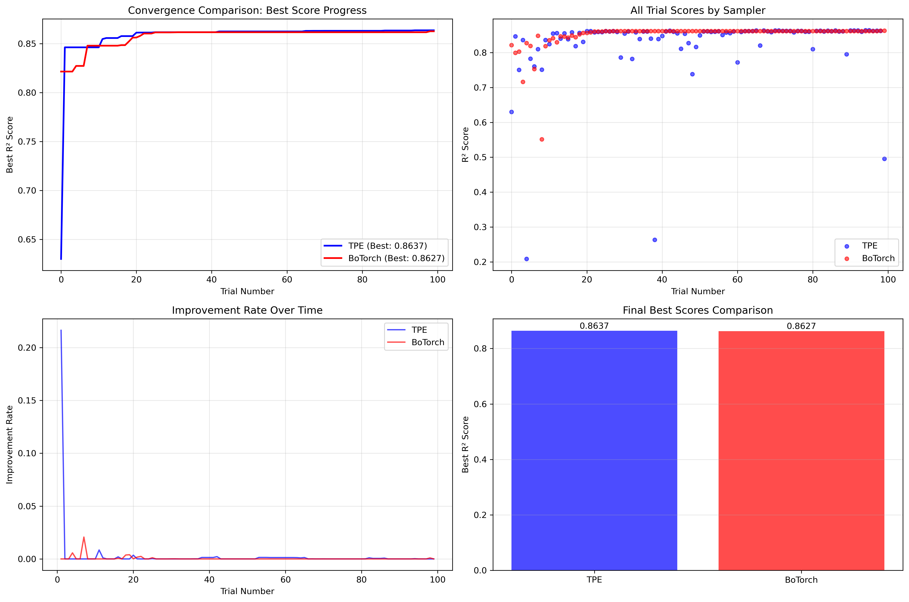
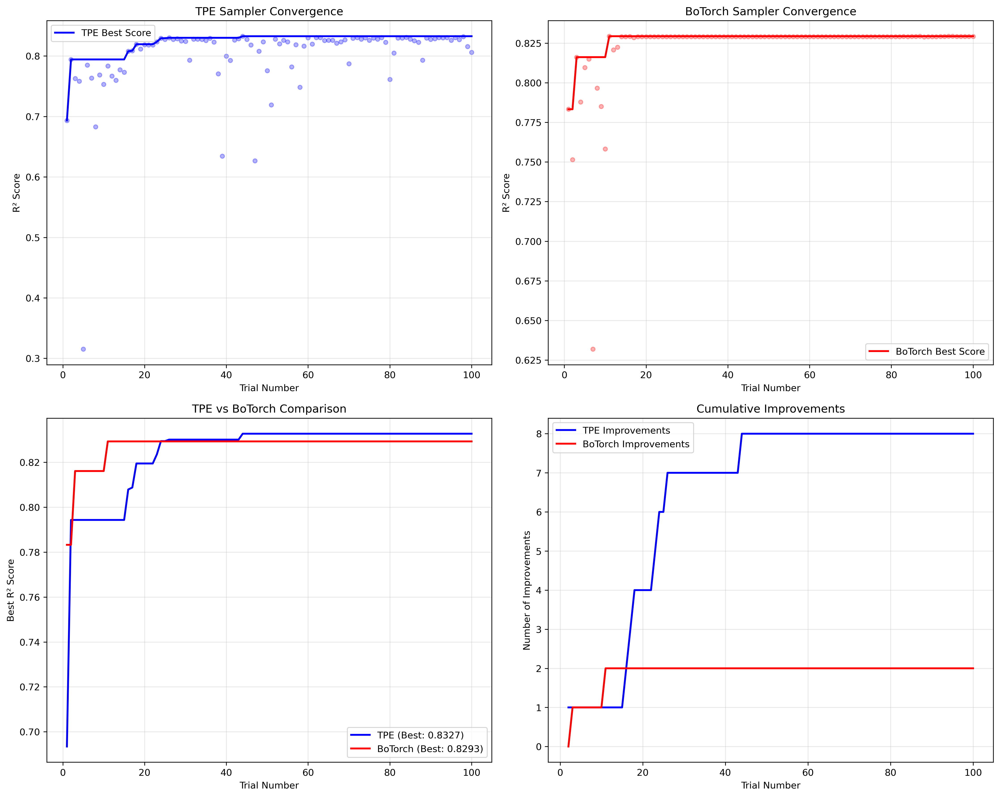

Examples
========

This section contains practical examples demonstrating SURGE capabilities.

.. toctree::
   :maxdepth: 2

   hyperparameter_optimization
   bayesian_optimization
   model_comparison

Hyperparameter Optimization Examples
-------------------------------------

Basic Random Forest Optimization
~~~~~~~~~~~~~~~~~~~~~~~~~~~~~~~~~

.. literalinclude:: ../../examples/simple_optuna_demo_ruff_preview.py
   :language: python
   :caption: Simple hyperparameter optimization with Optuna

Comprehensive Optimization Comparison
~~~~~~~~~~~~~~~~~~~~~~~~~~~~~~~~~~~~~~

.. literalinclude:: ../../examples/comprehensive_optimization_demo.py
   :language: python
   :caption: Comparing TPE vs BoTorch samplers

Bayesian Optimization with BoTorch
~~~~~~~~~~~~~~~~~~~~~~~~~~~~~~~~~~~

.. literalinclude:: ../../examples/bayesian_optimization_demo.py
   :language: python
   :caption: Advanced Bayesian optimization demo

Interactive Notebooks
----------------------

The following Jupyter notebooks provide interactive examples:

* `Botorch Performance Comparison <../../notebooks/Test_Botorch_Pe_NSTX_Compare.ipynb>`_
* `Model Loading and Testing <../../notebooks/test_load.ipynb>`_

Visualization Examples
----------------------

The examples generate various plots and visualizations:

   
   Comparison of different optimization strategies

   
   TPE vs BoTorch sampler convergence comparison
