# Results gallery

What SURGE produces, by problem type. Every figure below is generated
from machine-readable run artifacts by the SURGE visual system — nothing
is hand-drawn or hand-entered. Regenerate all of them (light **and**
dark variants, deterministic PNG/SVG/PDF) with:

```bash
python examples/viz_theme_gallery.py
python scripts/sync_readme_assets.py                        # curate into docs/
python -m surge.report.leaderboard --out leaderboard.html   # dashboard
```

## Tabular regression

Parity density in the SURGE signature style — reversed-plasma colormap,
log-scaled counts, train/test panels, R² boxes — here for the QLKNN
ITG heat-flux surrogate (random-forest baseline; the HPO-tuned residual
MLP reaches R² 0.96 on the same task).


## Hyperparameter optimization

Per-model Optuna history: solid per-trial trace, dashed running best,
gold star at each model's optimum with its score.


## Neural-network training

Per-epoch train/validation loss from the JSONL training logs: shaded
generalisation gap, best epoch marked, power-law convergence fit, and
smoothed early stopping (patience on the rolling-mean validation loss)
terminating training at true saturation.

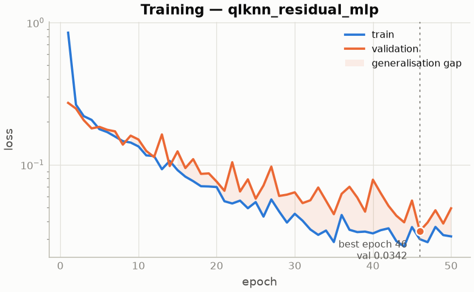

## Classification

ROC, precision–recall, confusion matrix (counts + shares), and a
reliability diagram with per-bin calibration gaps and ECE.

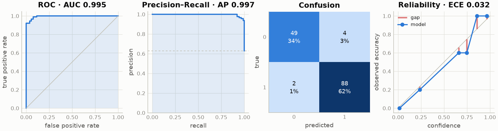

## Operator learning (fields / PDEs)

Burgers' equation surrogate trained through the registry: best / median /
worst test samples, the signed-error field over the whole test set
(sorted by per-sample rel-L2), and the error distribution.

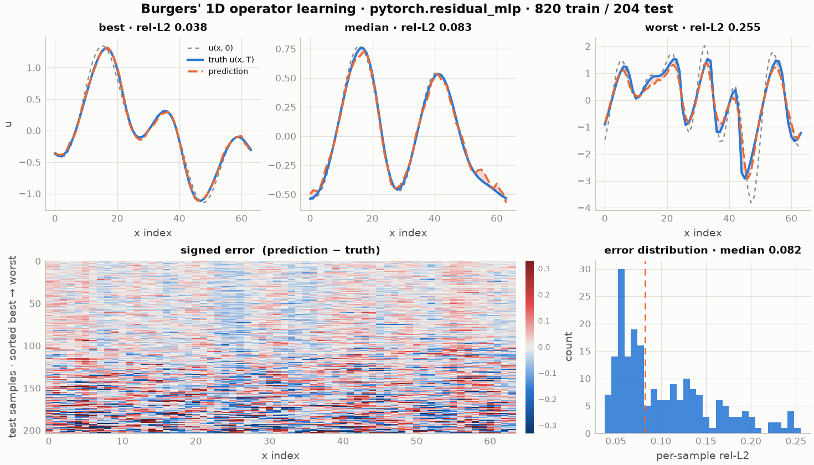

## 2D operator learning

FNO-2D learns the periodic Poisson solver (source → solution) at median
rel-L2 0.006 on 32×32 fields generated on the fly — U-Net covers the
same task shape.

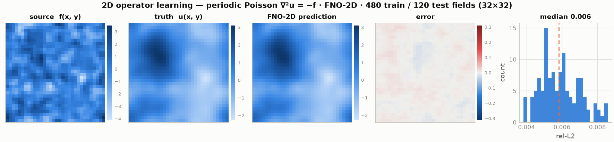

## External PDE benchmark — TheWell Gray-Scott

Operator forecasting on the Gray-Scott reaction–diffusion system from
[TheWell](https://polymathic-ai.org/the_well/) (Ohana et al., NeurIPS
2024): predict the 64×64 species-B field 160 stored steps ahead. The
horizon is set where the persistence baseline ("predict no change",
green bar) visibly fails — at single-step the task is trivial
(persistence rel-L2 0.002). U-Net with a residual target leads (median
rel-L2 0.206) and is the only architecture beating persistence (0.265);
FNO-2D blurs the sharp Turing interfaces at this horizon and DeepONet's
global low-rank basis cannot localize. Reproduce with:

```bash
# note: the full Gray-Scott archive is ~132 GB (117 train + 15 valid)
python -c "from surge.benchmarks.loaders.thewell import download_thewell; download_thewell('gray_scott')"
python examples/thewell_grayscott_study.py
```

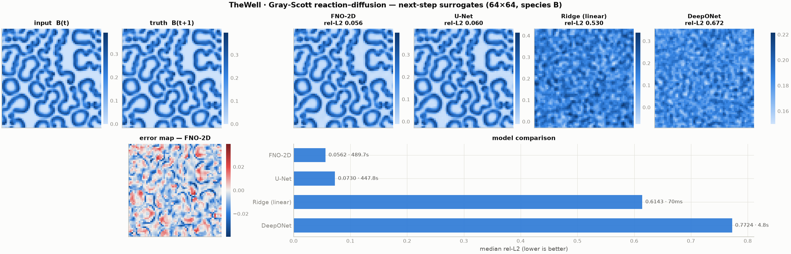

The single-step task (`--horizon 1`) exists too and shows why the
horizon matters: every model — even residual DeepONet at rel-L2 0.020 —
loses to persistence at 0.002, so a leaderboard on it would measure
nothing.


## External PDE benchmark — TheWell turbulent radiative layer

A second Well system, with the opposite verdict to Gray-Scott: on this
fast-mixing task (64×192 non-square grid, log density, Δt = 8 stored
steps) every neural operator beats persistence — U-Net 0.250 and FNO-2D
0.256 vs 0.355 — each trained in ~4 min on the Apple GPU
(`SURGE_DEVICE=auto`).

```bash
python -c "from surge.benchmarks.loaders.thewell import download_thewell; download_thewell('turbulence_2d')"  # ~6 GB
SURGE_DEVICE=auto python examples/thewell_turbulence_study.py
```

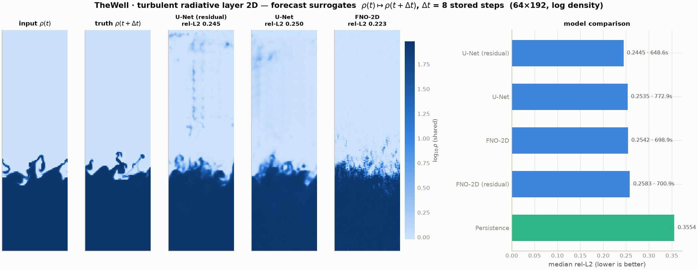

## External PDE benchmark — TheWell Helmholtz staircase

Harmonic phase advance from the (Re, Im) pressure quadratures: a ¼-cycle
shift decorrelates the standing wave, so persistence fails at rel-L2
1.38 while FNO-2D reaches 0.0195 — smooth wave physics is the spectral
model's home turf. Together the three Well systems (Gray-Scott,
turbulence, Helmholtz) show no single operator architecture wins
everywhere.

```bash
python -c "from surge.benchmarks.loaders.thewell import download_thewell; download_thewell('helmholtz')"  # ~46 GB
SURGE_DEVICE=auto python examples/thewell_helmholtz_study.py
```

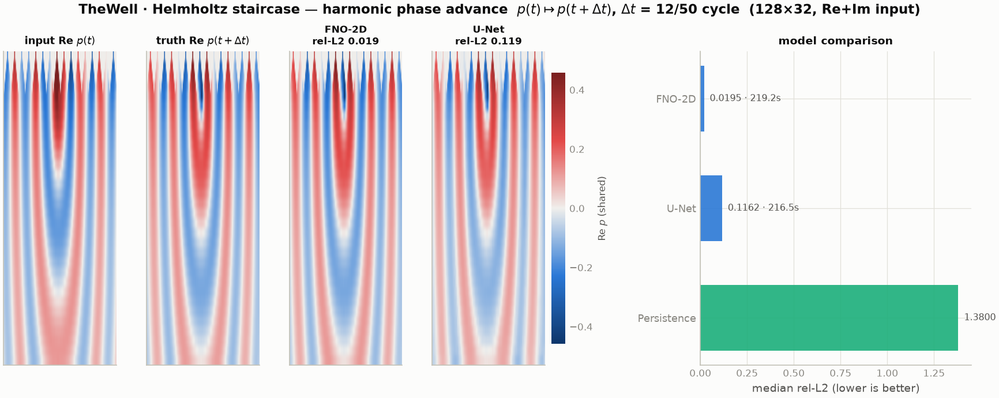

## POD reduced-order surrogates

`pod_fit/pod_transform/pod_inverse` (surge.preprocessing) turn any
tabular model into a field surrogate through k POD modes. On the
low-rank Helmholtz wave, ridge through 64 modes reaches rel-L2 0.0017 —
11× better than FNO-2D at ~10,000× less training compute; on the
chaotic turbulent layer POD+ridge still edges the U-Net. The dotted
line is the POD reconstruction ceiling (representation limit at each k).

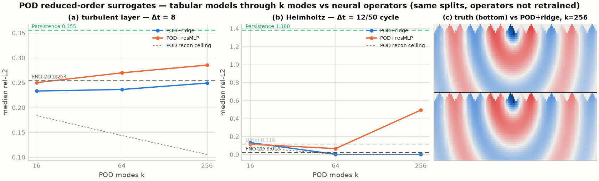

## Probabilistic turbulence forecasting (CRPS)

Pointwise error on the turbulent layer is chaos-limited (7-lever study),
so the honest forecast is a distribution: an 8-member deep ensemble on
64 POD modes. Calibrated CRPS 0.095 beats the best point forecast by
18%, with spread–skill correlation 0.88.

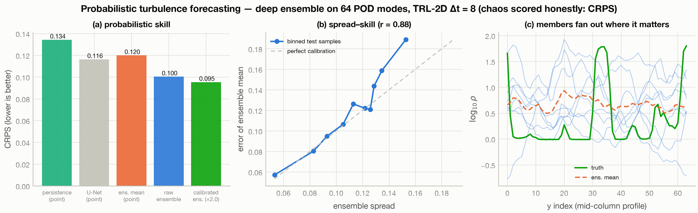

## Simulation-based inference — Simformer

One score-based transformer over the joint p(θ, x) samples every
conditional: posterior, likelihood, joint, or inference with missing
observables (`pytorch.simformer`, Gloeckler et al. ICML 2024).
Validated against the linear-Gaussian benchmark's closed-form posterior.

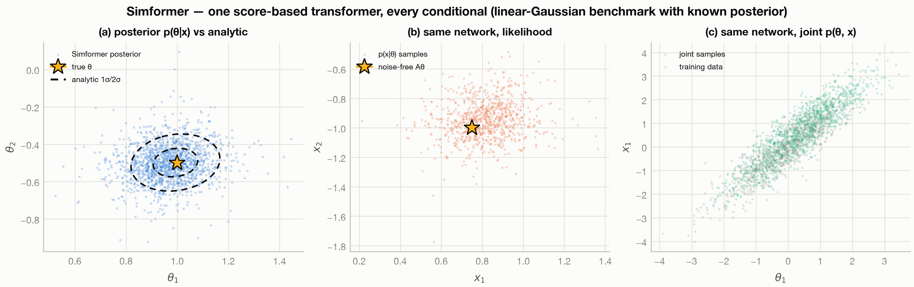

## Stellarator design — ConStellaration

One residual MLP maps stellarator plasma-boundary Fourier coefficients
(R_mn, Z_mn; n_fp = 3) to 12 equilibrium figures of merit across 26,897
QI-like configurations (Cadena et al. 2025, arXiv:2506.19583): real
rotating boundary cross-sections, log₁₀(QI) parity at R² 0.93, and
per-metric learnability.

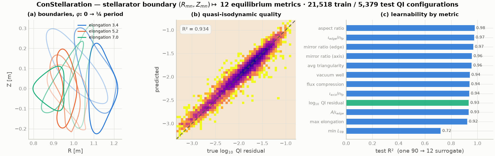

## HPO mission control

The per-trial artifacts of an HPO campaign rendered as a one-look
dashboard: all validation-loss curves with the winning trial highlighted,
search convergence with the starred best, run-summary card, best-trial
train/val detail, parameter sensitivity, and the tuned model's test
parity.


## Multi-backend comparison

Random forest, PyTorch MLP, and an exact Gaussian process trained on
identical QLKNN splits through the one registry — the small-data regime
is where the GP earns its keep.

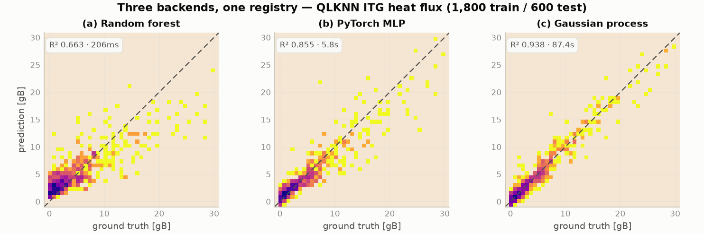

## Deep-ensemble uncertainty

`pytorch.mlp_ensemble` mean ± 2σ with honest calibration: raw ensemble
spread is overconfident; σ-rescaling on a held-out split recovers
near-Gaussian coverage.

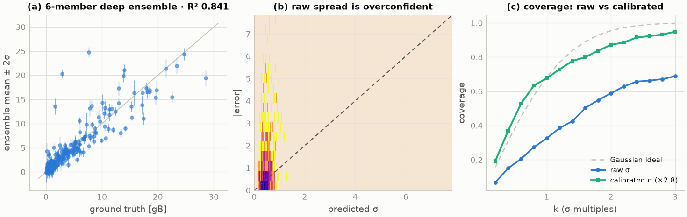

## Uncertainty quantification

Gaussian-process surrogate with nested 68/95% credible bands — the band
widens where training data is absent; truth coverage is annotated.


## Dataset characterization (pre-training)

Input distributions, target distribution, signal-to-noise, input–target
correlations, the strongest single relationship, and the PCA variance
spectrum with effective dimensionality.


## Training at scale

Measured on a stock Apple-Silicon workstation
(`scripts/benchmark_scale.py` regenerates on your hardware): opt-in GPU
via `SURGE_DEVICE=auto` (7–8× for the 2D operator models, identical R²)
and the `surge bench --parallel N` subprocess fan-out against ideal 1/N.

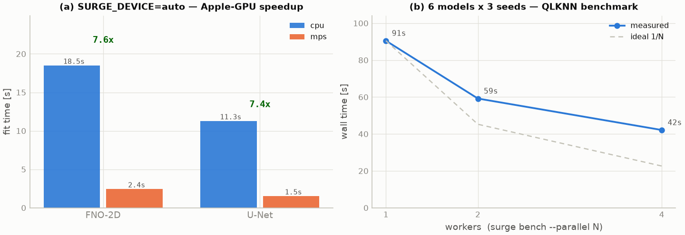

## Benchmark leaderboards

Score ± std across repeated runs against the published threshold, with
runtime on a separate log-scale panel. The interactive HTML dashboard
(`surge report`) adds spider charts, per-benchmark dataset previews,
citations, and sortable tables.

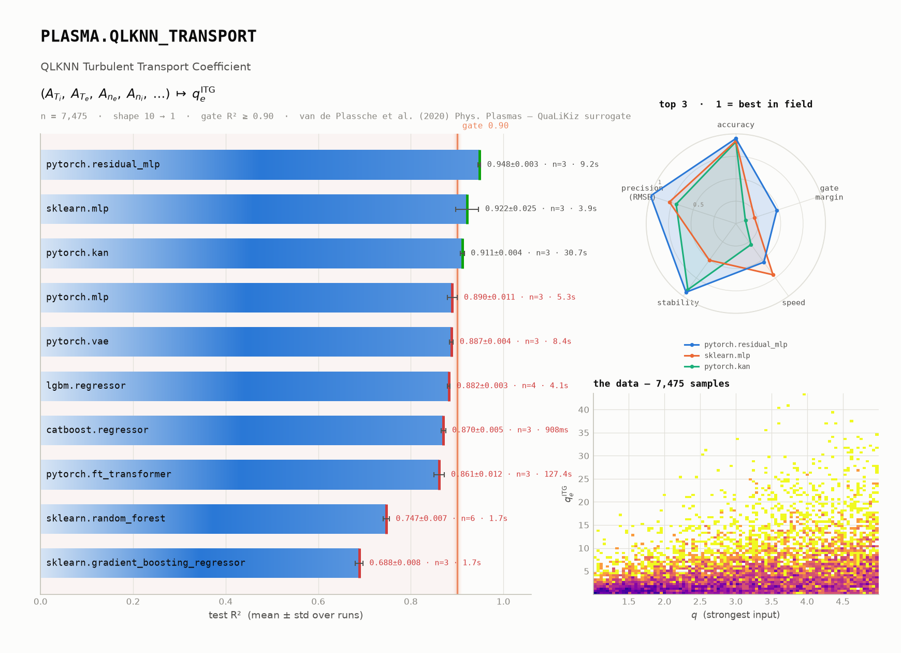
