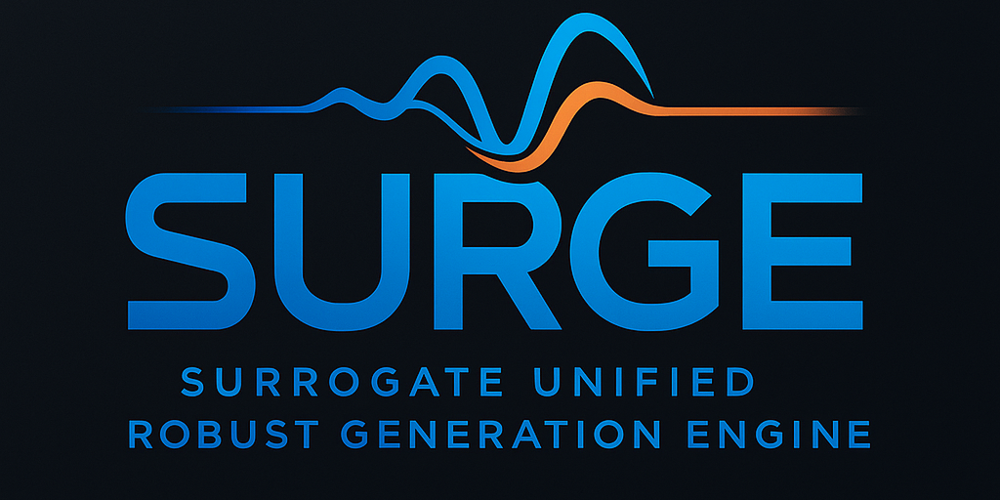

SURGE
=====

*A Surrogate Unified Robust Generation Engine*

**SURGE** is a modular AI/ML framework for building fast, accurate, and uncertainty-aware 
surrogate models that emulate complex scientific simulations. The latest refactor consolidates
the codebase under the ``surge/`` package and centers around a single configuration-driven
workflow (``surge.workflow``) that handles datasets, splitting, standardization, model training,
Optuna HPO, artifact tracking, and visualization.

.. _surge-pipeline:

End-to-End Surrogate Modeling Pipeline
======================================

SURGE provides a fully automated AI/ML-powered pipeline for surrogate generation:

1. **Dataset Ingest** – ``SurrogateDataset`` auto-detects inputs/outputs, applies metadata overrides, drops NaNs, and summarizes stats/memory/missingness.
2. **Splitting & Scaling** – ``SurrogateEngine`` builds deterministic train/val/test splits and applies ``StandardScaler`` bundles (stored per run).
3. **Model Registry** – RFR (scikit-learn), Torch MLP with MC-Dropout, and GPflow GPR are registered adapters with unified ``fit/predict/predict_with_uncertainty`` APIs.
4. **Hyperparameter Optimization** – Optuna-driven sweeps (TPE or BoTorch) can be toggled per model via YAML or ``HPOConfig``; trials export to JSON.
5. **Training & Validation** – Metrics (R², RMSE, MAE, MAPE) and timings (train/inference per sample) are recorded for train/val/test.
6. **Artifacts** – Models, scalers, predictions, metrics, spec, environment snapshot, and git revision land under ``runs/<tag>/``.
7. **Visualization** – ``surge.viz`` exposes density scatter, violin/SNR, correlation heatmaps, and per-mode scatter utilities; the M3DC1 notebook demonstrates them end-to-end.

This vertical "code → automation → surrogate inference" flow means you can move from raw simulation code to deployable, uncertainty-aware surrogate models with minimal boilerplate.

Main Applications
-----------------

SURGE has been designed to support a wide range of scientific and engineering use cases:

- **Real-time Control & Monitoring**  
  Replace expensive physics solvers with fast surrogates for in-shot decision making.

- **Design Optimization**  
  Embed surrogate models into optimization loops (e.g., Bayesian, genetic) for rapid parameter sweeps.

- **Uncertainty-Aware Prediction**  
  Leverage Gaussian Process Regressors to get both point estimates and confidence bounds.

- **Digital Twin Integration**  
  Seamlessly integrate surrogates into digital-twin frameworks for what-if analyses.

- **High-Performance Computing (HPC)**  
  Streamline training and inference workflows on clusters using standard ML libraries.

Core Functionalities
--------------------

- **Workflow-first API** – use ``run_surrogate_workflow`` with YAML specs (see ``configs/``).  
- **Dataset analysis** – ``surge.dataset`` handles multi-format loads (CSV, HDF5, NetCDF, pickle) and enforces clean numeric frames before scaling.  
- **Optuna integration** – per-model search spaces defined inline, supporting categorical lists (e.g., hidden layer templates) and loguniform ranges.  
- **Artifact standardization** – consistent directory layout for reproducibility + notebooks/tests.  
- **Notebook parity** – CLI runs and ``notebooks/M3DC1_demo.ipynb`` share the same configs/specs.  

.. toctree::
   :maxdepth: 2
   :caption: Contents:

   SURGE_OVERVIEW
   overview
   installation
   quickstart
   api_reference/index
   examples/index

🚀 Quick Start
--------------

.. code-block:: bash

   # Baseline M3DC1 workflow (1k-row sample)
   conda run -n surge python -m examples.m3dc1_workflow \
       --spec configs/m3dc1_demo.yaml --run-tag m3dc1_demo_cli

   # Augmented workflow (all 9,981 samples + 50 Optuna trials/model)
   conda run -n surge python -m examples.m3dc1_workflow \
       --spec configs/m3dc1_demo_augmented.yaml --run-tag m3dc1_demo_full

   # Notebook exploration
   conda run -n surge jupyter lab notebooks/M3DC1_demo.ipynb

Programmatic usage mirrors the CLI by loading ``SurrogateWorkflowSpec`` from YAML and passing it to ``run_surrogate_workflow``.

Indices and tables
==================

* :ref:`genindex`
* :ref:`modindex`
* :ref:`search`
