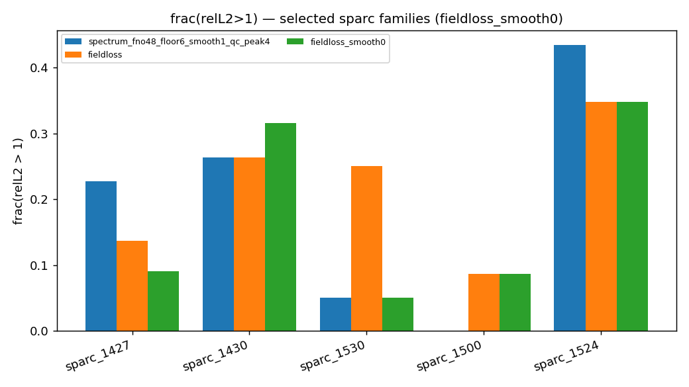

# SURGE × M3DC1 δp̂ Spectrum Surrogate — Research Narrative

**Companion to** [`SURGE_M3DC1_RESULTS_REPORT.md`](SURGE_M3DC1_RESULTS_REPORT.md) (full workflow, figures, and run logs — **unchanged**).

**Facts only (no interpretation):** [`SURGE_M3DC1_FACTS.md`](SURGE_M3DC1_FACTS.md) · [HTML](SURGE_M3DC1_FACTS.html) · [JSON](SURGE_M3DC1_FACTS.json)

**Status:** 2026‑07‑06 · test split **n = 1994** · oracle‑phase field metrics unless noted.

This document is a **story-first synthesis** of the eigenmode spectrum surrogate work: one
thread from “high patR²” to “what actually reconstructs δp(R,Z)”, with **factual tables**
and links to evidence. Use it for papers, Opus, or stakeholder briefings; use the main report
for reproducibility commands and asset paths.

---

## 1. One-paragraph story

We train a 2D FNO on max-normalized log₁₀|δp̂|(m, ψ_N) with equilibrium inputs only.
**Pattern R² on the spectrum image is a misleading selection metric:** `qc_mhi100` has the
best patR² (median **0.932**, only **18%** of cases below 0.9) but the **worst** field quality
(frac(relL2>1) **0.27**). Adding a differentiable **field-loss** term and selecting checkpoints
by field relL2—not patR²—cuts broken field cases from **358 → 200** vs production `qc_peak4`.
A family-level regression on **sparc_1530** (edge-localized modes) led to targeted single-lever
runs: **geom channels** fix that family but not the global leaderboard; **reducing target
smoothing** (Runs **D** / **D′**) yields the largest global field gains. **Run D′** (`σ=0`) is
the best **field** model on the full test set; **Run D** (`σ=0.5`) is slightly better on
sparc_1530. Both pay a large **patR²** cost (~90–97% of cases below 0.9 vs ~40% for `_qc`).

---

## 2. What we measure (two different “accuracies”)

| Metric | Definition | Optimized by default training? | Deployment meaning |
|--------|------------|----------------------------------|--------------------|
| **Pattern R²** | Correlation of mean-subtracted log spectrum on uniform 128×128 (m, ψ_N) grid | Yes (val_r2 / patR²) | “Does the ridge *shape* in log space match?” |
| **Field relL2** | IFFT predicted \|δp̂\| with **true phase** → Re(δp)(R,Z), max-normalized, relL2 vs GT | Only with `--field-loss-weight` + `--select-by field` | “Does the **physical field** look right?” (oracle φ) |

**Critical caveat (§9.4 of main report):** all field numbers below use **oracle true phase**.
Magnitude is learned; phase is borrowed from GT. Estimated-phase field relL2 is future work.

**Why the metric gallery can look “best” for D′ while patR² is terrible:** the gallery rows are
fixed test cases (same ordering as `_qc` p2…p98). Lower field relL2 in the Δ panels is the
relevant signal for deployment; the histogram header patR² is computed on **all 1994** cases and
penalizes sharp targets that are harder to fit in log-correlation space.

Evidence — D′ combined gallery (spectrum + field, same cases as `_qc`):

Field-only panels:

Compare to production `qc_peak4` (same case order):

---

## 3. Experiment map (single-lever discipline)

All runs share: FNO2D, modes 48, hidden 32, m ∈ [−80, 20], grid 128, floor −6 dex,
quarantine 2 bad cases, `--peak-weight 4`, seed 42, **n = 9974** cases (6983/997/1994 split).

| ID | Run directory (short) | **One lever changed** | Checkpoint (field-selected) |
|----|------------------------|------------------------|-----------------------------|
| baseline | `…_qc_peak4` | peak-weight 4, σ=1 | patR² selection |
| **fieldloss** | `…_fieldloss` | + field loss w=0.5, select-by field | **epoch 45** |
| **Run B** | `…_fieldloss_geom` | + `--geom-channels` (14 inputs) | epoch ~140 |
| **Run D** | `…_fieldloss_smooth05` | `--target-smooth 0.5` (was 1) | epoch **205** |
| **Run D′** | `…_fieldloss_smooth0` | `--target-smooth 0` | epoch **50** |
| counter | `…_qc_mhi100` | m ∈ [−80, **100**] | patR² (wide m trap) |
| ref | `…_qc` | no peak-weight | patR² |

**Not run (by design):** Run A alone after sparc_1530 showed hi_m=0; Run C (geom + wide m).

---

## 4. Master results table (test split, n = 1994)

### 4.1 Field quality (primary metric for deployment)

| Model | frac(relL2>1) ↓ | p90 ↓ | median | mean ↓ | CRF ↑ | broken cases |
|-------|----------------:|------:|-------:|-------:|------:|-------------:|
| `qc_mhi100` | 0.267 | 1.351 | 0.825 | 0.921 | 0.788 | ~532 |
| `_qc` | 0.200 | 1.217 | 0.741 | 0.821 | 0.738 | ~399 |
| **`qc_peak4`** (prev prod) | **0.180** | **1.165** | **0.730** | **0.808** | **0.825** | **358** |
| fieldloss **σ=1** | 0.100 | 1.001 | 0.632 | 0.702 | 0.907 | 200 |
| Run B **geom** | 0.122 | 1.061 | 0.642 | 0.719 | **0.929** | 244 |
| **Run D σ=0.5** | 0.051 | 0.820 | 0.455 | 0.527 | 0.711 | ~102 |
| **Run D′ σ=0** | **0.048** | **0.803** | **0.421** | **0.491** | 0.605 | **96** |

Sources: [`field_bench/with_fieldloss/`](../../field_bench/with_fieldloss/leaderboard.json),
[`with_fieldloss_geom/`](../../field_bench/with_fieldloss_geom/leaderboard.json),
[`with_fieldloss_smooth05/`](../../field_bench/with_fieldloss_smooth05/leaderboard.json),
[`with_fieldloss_smooth0/`](../../field_bench/with_fieldloss_smooth0/leaderboard.json),
[`field_bench/leaderboard.json`](../../field_bench/leaderboard.json).

### 4.2 Spectrum patR² (secondary — report if spectrum score matters)

| Model | median patR² | mean patR² | **% cases patR² < 0.9** |
|-------|-------------:|-----------:|------------------------:|
| `qc_mhi100` | **0.932** | **0.906** | **18.4%** |
| `_qc` | 0.908 | 0.892 | 40.2% |
| `qc_peak4` | 0.910 | 0.895 | 36.4% |
| fieldloss σ=1 | 0.908 | 0.888 | 39.3% |
| Run B geom | 0.912 | 0.898 | 38.1% |
| Run D σ=0.5 | 0.826 | 0.816 | **90.3%** |
| **Run D′ σ=0** | 0.750 | 0.744 | **96.8%** |

Source: `predictions_cache.npz` per run, test split.

**Takeaway:** fieldloss σ=1 improved field metrics vs peak4 **without** hurting patR² (~40%
below 0.9, same as `_qc`). D/D′ improved field further at a **deliberate** patR² cost.

---

## 5. Why patR² and field relL2 diverge (mechanism)

1. **patR²** is shape correlation after removing the mean on the training grid — relatively
   blind to peak amplitude and IFFT leakage.
2. **Field relL2** penalizes what survives inverse transform with true phase.
3. **Target smoothing σ=1** blurs training targets → easier patR², softer peaks → worse fields.
4. **Field-loss gradient** aligns spectral errors with field damage; **select-by field** stops
   early when patR² still climbs (epoch 45 vs 400 — see main report §9.1).
5. **mhi100** adds high‑m columns that help patR² but add noise in field reconstruction →
   worst frac>1 on the bench.

Evidence — patR² is not field quality:

| | patR² median | frac>1 |
|---|-------------:|-------:|
| mhi100 | **best (0.932)** | **worst (0.27)** |
| D′ | worst among field-loss family (0.75) | **best (0.048)** |

---

## 6. Chapter: field-loss baseline (main report §7–§9)

**Question:** Does training against field error beat patR²-selected models?

**Answer:** Yes. vs `qc_peak4`: pairwise **1691–303** (fieldloss σ=1 wins 85% of cases).

**Production pin in main report:** `runs/…_fieldloss/ckpt_fno2d.pt` epoch **45** (not `last.pt`).

**Known blemish:** sparc_1530 family regressed (frac>1 **0.05 → 0.25**) — triggered §9.3 diagnosis.

---

## 7. Chapter: sparc_1530 diagnosis → Run B (not Run A)

**Question:** Edge geometry or missing high‑m modes?

**Evidence on worst regressions:** frac_E(m>20) = **0** for all top cases; peak ψ_N ≈ **0.85–1.0**
(pedestal/LCFS). → **Run B** (geom), not Run A (wide m).

Diagnosis plots: [`assets/sparc1530_diagnosis/`](assets/sparc1530_diagnosis/)

### Run B result (geom + fieldloss)

| | global mean relL2 | frac>1 | sparc_1530 mean | sparc_1530 frac>1 |
|---|------------------:|-------:|----------------:|------------------:|
| fieldloss σ=1 | 0.702 | 0.10 | 0.813 | **0.25** |
| **Run B geom** | 0.719 | 0.12 | **0.678** | **0.05** |
| vs fieldloss pairwise | — | geom loses **705–1289** globally | **fixed family** | |

**Conclusion:** geom channels are a **family fix**, not a global production upgrade. Keep for
edge-heavy equilibria or ensemble; do not replace fieldloss σ=1 on global field rank alone.

Gallery: [`metric_reality_check_qc_peak4_fieldloss_geom_refqc_combined.png`](assets/metric_reality_check_qc_peak4_fieldloss_geom_refqc_combined.png)

---

## 8. Chapter: Runs D and D′ (target smoothing ablation)

**Question:** Does unsmoothing the training target improve peak/field fidelity?

**Setup:** Same field-loss recipe as baseline; **only** `--target-smooth` changed (1 → 0.5 → 0).

### 8.1 D vs D′ head-to-head (full test)

| | Run D (σ=0.5) | **Run D′ (σ=0)** | Δ (better ↓ for relL2) |
|---|--------------:|-----------------:|------------------------|
| frac>1 | 0.051 | **0.048** | D′ |
| p90 | 0.820 | **0.803** | D′ |
| mean relL2 | 0.527 | **0.491** | D′ |
| median relL2 | 0.455 | **0.421** | D′ |
| broken cases | ~102 | **96** | D′ |
| **Pairwise** | — | **1466 vs 528** | D′ wins 74% |
| vs fieldloss σ=1 | 1828–166 | **1837–157** | both crush baseline |

### 8.2 Where D beats D′

| sparc_1530 (n=20) | mean relL2 | frac>1 |
|-------------------|----------:|-------:|
| peak4 | 0.735 | 0.05 |
| fieldloss σ=1 | 0.813 | 0.25 |
| Run B geom | 0.678 | 0.05 |
| **Run D σ=0.5** | **0.616** | 0.05 |
| Run D′ σ=0 | 0.689 | 0.05 |

D is the best field model on the diagnosed edge family; D′ is still much better than fieldloss σ=1 there.

sparc_1530 panels: [`assets/sparc1530_smooth_ablation/`](assets/sparc1530_smooth_ablation/)

### 8.3 patR² cost (why the gallery header looks “bad”)

| | % patR² < 0.9 |
|---|-------------:|
| `_qc` / fieldloss σ=1 | ~**40%** |
| Run D | **90%** |
| Run D′ | **97%** |

Unsmoothing makes targets sharper → harder log-spectrum fit → lower patR² **even when fields improve**.

### 8.4 Visual evidence

| Asset | Run |
|-------|-----|
|  | D′ worst/median/best |
|  | D |
|  | D′ vs peak4/baseline |
|  | D |
|  | D′ vs fieldloss |
|  | families |

Training curves: [`loss_fieldloss_smooth0_fno2d.png`](assets/loss_fieldloss_smooth0_fno2d.png),
[`loss_fieldloss_smooth05_fno2d.png`](assets/loss_fieldloss_smooth05_fno2d.png)

---

## 9. Decision guide (which checkpoint when)

| Your priority | Recommended model | Checkpoint | Caveat |
|---------------|-------------------|------------|--------|
| **Best global field relL2** | **Run D′** `…_fieldloss_smooth0` | `ckpt_fno2d.pt` ep **50** | patR² ~97% below 0.9; CRF drops to 0.61 |
| **Best sparc_1530 / edge family** | **Run D** `…_smooth05` | ep **205** | Slightly worse global than D′ |
| **Balance field win + patR² ~ `_qc`** | **fieldloss σ=1** | ep **45** | Main report §9 production pin |
| **Best patR² / spectrum leaderboard** | peak4 or mhi100 | — | **Not** for field deployment |
| **sparc_1530-only fix without smooth trade** | Run B geom | ep ~140 | Loses global field rank vs σ=1 |

**If you liked the D′ metric gallery:** that is consistent with **field-first** selection. It is
**not** consistent with patR²-first selection — use fieldloss σ=1 or peak4 instead.

---

## 10. How this updates the main report (without replacing it)

[`SURGE_M3DC1_RESULTS_REPORT.md`](SURGE_M3DC1_RESULTS_REPORT.md) remains the **lab notebook**:
§4 target conditioning, §7 field bench introduction, §9 field-loss experiment through §9.5 planned
Runs A/B/C.

**This narrative adds (post‑§9 work, July 2026):**

| Main report section | Still valid? | New facts to append (or read here) |
|--------------------|--------------|-------------------------------------|
| §9.2 production = fieldloss ep 45 | Valid as **balanced** pick | Superseded for **max field** by D′ |
| §9.3 sparc_1530 regression | Valid trigger | **Resolved** by D (0.616), geom (0.678), D′ (0.689) — not by σ=1 alone |
| §9.5 Runs A/B/C planned | B, D, D′ **done**; A/C skipped | Results in §7–8 above |
| §7 mhi100 patR² vs field | Core lesson | Unchanged — anchor for “wrong metric” |

Suggested one-line addition to main report header (optional):

> **Follow-up (2026‑07‑06):** Runs B, D, D′ — see
> [`SURGE_M3DC1_RESEARCH_NARRATIVE.md`](SURGE_M3DC1_RESEARCH_NARRATIVE.md).

---

## 11. Suggested “paper outline” (for Opus / draft)

1. **Introduction** — eigenmode δp̂ surrogate; shape vs amplitude gauge; deployment via field recon.
2. **Methods** — FNO on (m, ψ_N); max-norm log target; field-loss + oracle phase; `field_bench`.
3. **Result 1** — patR² mis-ranks models (mhi100 vs peak4 vs fieldloss).
4. **Result 2** — field-loss training + field checkpoint selection (1691–303 vs peak4).
5. **Result 3** — heterogeneous families (sparc_1530); diagnosis protocol (hi_m, peak ψ_N).
6. **Result 4** — single-lever follow-ups: geom (local), smoothing (global).
7. **Discussion** — two metrics; oracle phase limit; when to report patR² vs field relL2.
8. **Conclusion** — D′ for field deployment; fieldloss σ=1 if patR² must stay ~ `_qc`.

---

## 12. Artifact index (reproducibility)

| Artifact | Path |
|----------|------|
| Field benches | `field_bench/with_fieldloss{,_geom,_smooth05,_smooth0}/` |
| Postprocess script | `scripts/m3dc1/internal/postprocess_smooth_runs.sh` |
| Comparison charts | `scripts/m3dc1/internal/postprocess_smooth_ablation_assets.py` |
| Leaderboard JSON (D′) | [`assets/field_bench_leaderboard_fieldloss_smooth0.json`](assets/field_bench_leaderboard_fieldloss_smooth0.json) |
| Eval log | `logs/eval_fieldloss_smooth_runs_*.log` |

---

## 13. Open questions (honest limits)

1. **Estimated phase** — all field numbers are oracle-φ; deployment needs predicted phase or joint training.
2. **CRF drop on D′** (0.91 → 0.61) — coherent error structure changes; interpret with field panels, not CRF alone.
3. **Run E/F** (peak-weight ablation on D′ recipe) — not run; may recover patR² without losing field gains.
4. **Run A** — only justified if a family shows measurable m>20 energy; sparc_1530 did not.

---

*Generated from measured `field_bench` outputs and `predictions_cache.npz` statistics on Perlmutter, July 2026.*
