# SURGE × M3DC1 Surrogates — Workflow & Results Report

_Status snapshot: **2026‑07‑02**. Repo: **SURGE-exp**, branch `feat/m3dc1-on-model-bench`._

This report documents (1) how the data was generated and where it lives, (2) how the
SURGE training workflow is run, (3) the model zoo and where each model lives, and
(4) results for the three M3D‑C1 AI tasks that show real progress — **growth rate γ**,
**core/edge mode locator**, and the **eigenmode (δp̂ spectrum) predictor** — including
loss curves, run comparisons, and per‑case eigenmode visuals.

> **Headline update (2026‑07‑02):** the δp̂ spectrum model was pushed from global val
> R² ≈ 0.84 to **test global R² 0.920 / pattern R² 0.924** by three orthogonal levers —
> **target flooring** (clip the max‑norm log10 target at −6 dex), **target smoothing**
> (Gaussian σ=1 denoise), and **quarantining** the 2 corrupt cases found by a
> full‑dataset quality scan. A new **core‑mode balancing** toggle (`--balance-psi`)
> improves rare core modes (R² 0.897→0.908) and peak amplitude at a ~0.003 aggregate
> cost. See [§4.4](#44-pushing-past-084--target-conditioning-quarantine-core-balancing-20260702).
>
> _Prior headline (2026‑07‑01):_ the plateau was first broken by **per‑case max
> normalization** (val R² 0.605 → 0.836; per‑case pattern R² median −0.9 → 0.74).

> **Figures.** All images are committed next to this file under
> [`docs/m3dc1/assets/`](assets) and referenced with relative paths, so they render on
> GitHub and in the Markdown preview.

---

## 1. Data: source, generation, location

| Item | Value |
|---|---|
| Raw M3DC1 batch | `/pscratch/sd/a/asvillar/mp288/jobs/batch_16/` (10,201 case dirs: `run*/sparc_*/`) |
| Per‑case verification file | `csdata_deltap_b_ver.h5` (one per case dir) |
| Grid / spectrum | 201×201 (R,Z), poloidal harmonics `m ∈ [−100, 100]`, full FFT |
| Postprocess entry point | `m3dc1ml-run-batch` → [`m3dc1ml/.../postprocess/run_batch.py`](../../m3dc1ml/src/m3dc1ml/postprocess/run_batch.py) |
| Generation script | [`m3dc1ml/scripts/build_csdata_deltap_b_ver.sh`](../../m3dc1ml/scripts/build_csdata_deltap_b_ver.sh) (+ `.slurm`) |
| Scalars dataset (γ etc.) | [`data/datasets/SPARC/case_scalars_ver.parquet`](../../data/datasets/SPARC/case_scalars_ver.parquet) — **9,976 cases** |
| Dataset metadata | [`case_scalars_ver_metadata.yaml`](../../data/datasets/SPARC/case_scalars_ver_metadata.yaml) |
| Exploration notebook | [`m3dc1ml/notebooks/explore_csdata_deltap_b_test.ipynb`](../../m3dc1ml/notebooks/explore_csdata_deltap_b_test.ipynb) |
| Curation / validation notebook | [`m3dc1ml/notebooks/curate_validate_mlm3dc1_predictions.ipynb`](../../m3dc1ml/notebooks/curate_validate_mlm3dc1_predictions.ipynb) |

**What's inside each `csdata_deltap_b_ver.h5`:**
`spectrum/{p,br,bz,bphi}` (complex `spec[t, m, ψ]` + `m_modes`, `psi_norm`),
`pertfields/{p,p_hat,p_phi0,p_phiq,...}` (the δp field on the 201×201 R,Z grid),
`equilibrium/` (ψ(R,Z), grad‑ψ, magnetic axis), `flux_average/{q,p,ne,...}`,
`miller/{R0,a,kappa,delta}`, `parset/{ntor,pscale,batemanscale}`, `growth_rate/`.

**How generation works (short version):** M3DC1 runs produce `C1.h5` + `equilibrium.h5`
per case. `m3dc1ml` postprocess uses the M3DC1 `fpy` bindings + `flux_coordinates`
(PEST) to evaluate the perturbed pressure/field on the R,Z grid, poloidally
Fourier‑transforms to `δp̂(m, ψ_N)`, and stores both the field and the spectrum
(with a reconstruction self‑check). Code:
[`postprocess/build_sdata.py`](../../m3dc1ml/src/m3dc1ml/postprocess/build_sdata.py).

**A representative case** (field δp(R,Z), spectrum |δp̂|(m,ψ), and profiles), rendered
by the exploration notebook:

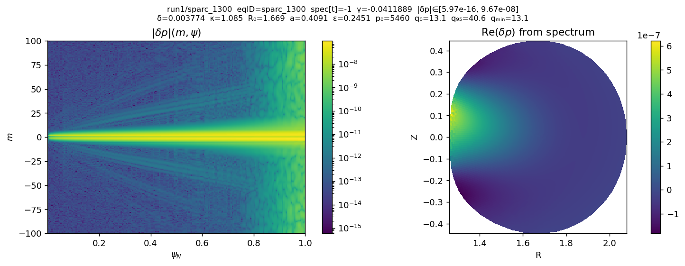

Repositories:
- SURGE (framework, experiments): **[github.com/S-Villar/SURGE-exp](https://github.com/S-Villar/SURGE-exp)** (branch `feat/m3dc1-on-model-bench`)
- M3DC1 postprocess/IO/viz: **[github.com/S-Villar/m3dc1ml](https://github.com/S-Villar/m3dc1ml)**

---

## 2. The SURGE training workflow

All tabular tasks share **one leakage‑free, case‑grouped split** so every model sees
exactly the same train/val/test partition. Grouping is by `run_id` + `eq_id`
(`GroupShuffleSplit`), so all rows from one physical case stay in one split.

- Engine / splitting / scaling: [`surge/engine.py`](../../surge/engine.py)
- Workflow spec (YAML): [`surge/workflow/spec.py`](../../surge/workflow/spec.py)
- Runner + artifacts: [`surge/workflow/run.py`](../../surge/workflow/run.py)
- HPO recipes (optuna): [`surge/benchmarks/hpo.py`](../../surge/benchmarks/hpo.py)

Each run writes: `metrics.json`, `workflow_summary.json`, `splits.json`
(+ `leakage_check`), `model_card_*.json`, `training_history_*.json`, and
`plots/training_dashboard_*.png`.

### 2.1 Preprocessing: per‑sample (per‑case) normalization — **new**

The δp̂ eigenmode has an **arbitrary overall amplitude** (the eigenvector normalization
is meaningless — cases range from `|δp|max ~ 1e4` to `~1e-7`); only the *shape* is
physical. SURGE now supports **per‑sample output normalization** so a model learns the
shape and the absolute scale is factored out:

- Primitives: `per_sample_max_scale` / `invert_per_sample_max_scale` in
  [`surge/preprocessing.py`](../../surge/preprocessing.py) (modes `max`, `absmax`, `l2`).
- Wired through the engine (`EngineRunConfig.output_per_sample_norm`,
  `ScalerBundle.output_per_sample_scale`): each output vector is divided by its own
  magnitude **before** any log/standardization, and the stored per‑row scale is used to
  invert predictions back to original units for metrics.
- Configurable from the workflow spec via `output_per_sample_norm`.

This is distinct from `StandardScaler` (global per‑column stats): it is parameter‑free
per row and is exactly what the eigenmode problem needs.

**Run a workflow (example — γ, all models):**
```bash
conda activate /global/cfs/projectdirs/m3716/software/asvillar/envs/surge
python scripts/m3dc1/internal/run_workflow.py configs/internal/m3dc1_gamma_ver_allmodels.yaml
```
Configs live in [`configs/internal/`](../../configs/internal). Full how‑to:
[`docs/m3dc1/TRAINING_RUNBOOK.md`](TRAINING_RUNBOOK.md),
spectrum how‑to: [`docs/m3dc1/SPECTRUM_TRAINING_RUNBOOK.md`](SPECTRUM_TRAINING_RUNBOOK.md),
HPO details: [`docs/m3dc1/HPO_COMPARISON.md`](HPO_COMPARISON.md).

---

## 3. Model zoo — what they are & where they live

| Model (key) | Type / architecture | Backend |
|---|---|---|
| `ridge` | Linear regression, L2 penalty (baseline) | sklearn |
| `random_forest` | Bagged decision‑tree ensemble | sklearn |
| `gradient_boosting` | Sequential boosted trees | sklearn |
| `sk_mlp` | sklearn feed‑forward MLP | sklearn |
| `torch_mlp` | PyTorch MLP (configurable depth/width) | [adapters](../../surge/model/adapters) |
| `residual_mlp` | MLP with residual/skip blocks | [`residual_mlp.py`](../../surge/model/backends/residual_mlp.py) |
| `geom_residual_mlp` | Residual MLP + geometry‑aware feature map | [adapters](../../surge/model/adapters/geometric_residual_mlp.py) |
| `mlp_ensemble` | Deep ensemble of MLPs (mean + uncertainty) | [`mlp_ensemble.py`](../../surge/model/backends/mlp_ensemble.py) |
| `ft_transformer` | Feature‑Tokenizer Transformer (tabular attention) | [`ft_transformer.py`](../../surge/model/backends/ft_transformer.py) |
| `vae` | Variational auto‑encoder w/ regression head | [`vae.py`](../../surge/model/backends/vae.py) |
| **`fno2d`** | **2D Fourier Neural Operator** — spectral conv in Fourier space, resolution‑invariant operator learning | [`fno2d.py`](../../surge/model/backends/fno2d.py) |
| **`unet`** | **U‑Net** — encoder/decoder CNN with skip connections | [`unet.py`](../../surge/model/backends/unet.py) |
| `deeponet` | Operator net (branch/trunk) | [`deeponet.py`](../../surge/model/backends/deeponet.py) |

The **spectrum‑image FNO2D/U‑Net** driver (2D `|δp̂|(m,ψ)` prediction with
physics‑informed conditioning channels incl. the `m − n·q(ψ)` resonance channel):
[`scripts/m3dc1/internal/train_spectrum_image.py`](../../scripts/m3dc1/internal/train_spectrum_image.py).
Net config: `_FNO2dNet(in=11, out=1, hidden=32, n_modes=16, n_layers=4)`,
`_UNetNet(in=11, out=1, base=48, depth=4)`.

---

## 4. Results

### 4.1 Growth rate γ (regression, 9,976 cases)

Target `gamma`; 11 equilibrium/scalar inputs; case‑grouped split.
Run: `runs/m3dc1_gamma_ver_allmodels/` · HPO: `runs/m3dc1_gamma_ver_batch_hpo/`.

| Model | test R² | test RMSE | test MAE |
|---|---:|---:|---:|
| **torch_mlp (HPO)** | **0.868** | 0.0164 | 0.0065 |
| mlp_ensemble | 0.858 | 0.0171 | 0.0063 |
| random_forest | 0.852 | 0.0174 | 0.0057 |
| torch_mlp | 0.852 | 0.0174 | 0.0065 |
| vae | 0.843 | 0.0179 | 0.0084 |
| residual_mlp | 0.833 | 0.0185 | 0.0072 |
| sk_mlp | 0.822 | 0.0190 | 0.0075 |
| gradient_boosting | 0.803 | 0.0200 | 0.0090 |
| ft_transformer | 0.782 (→ 0.850 w/ HPO) | 0.0211 | 0.0097 |
| geom_residual_mlp | 0.390 (→ 0.743 w/ HPO) | 0.0353 | 0.0232 |
| ridge (linear baseline) | 0.531 | 0.0309 | 0.0186 |

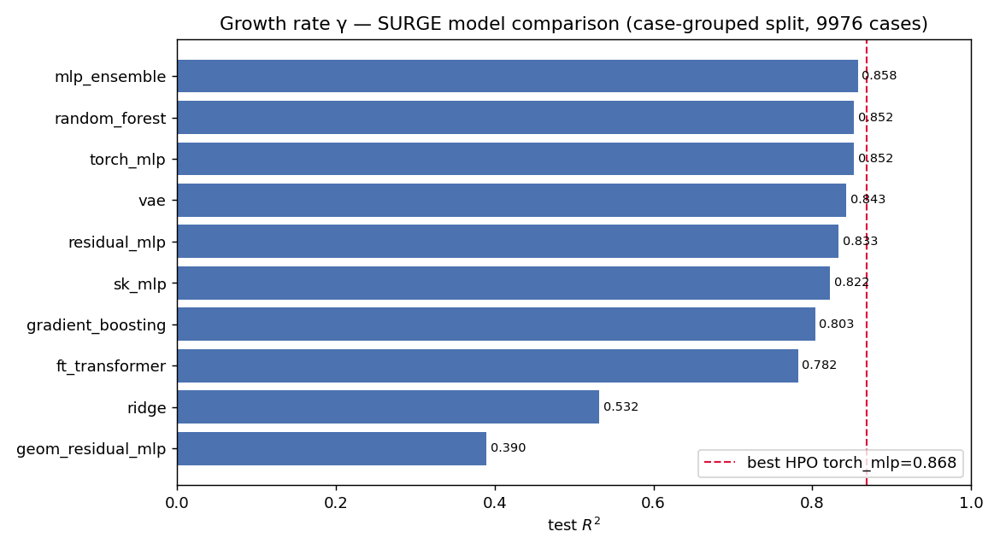

Best‑model predicted‑vs‑true and per‑model training dashboard:

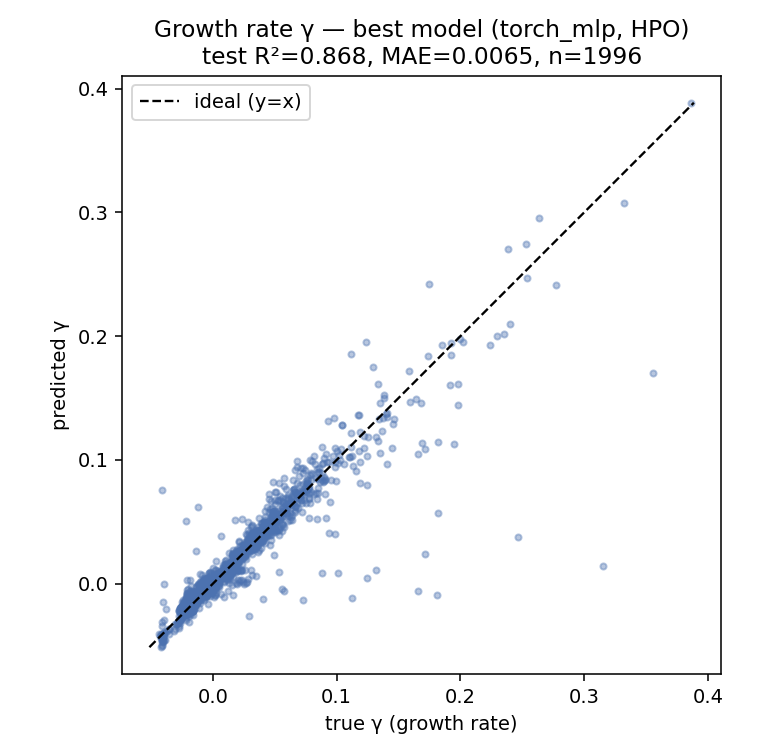

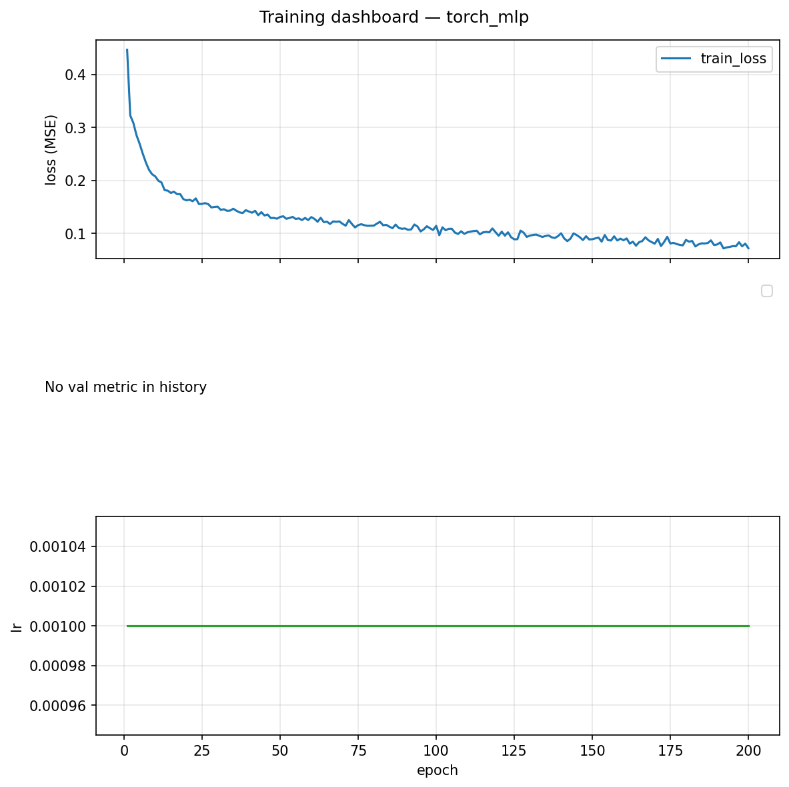

**Takeaway:** γ is well‑predicted from equilibrium scalars — best **R² ≈ 0.87** (HPO
torch_mlp), with a tight cluster of NN/ensemble/RF models around 0.85. Linear ridge
(0.53) confirms the relationship is strongly nonlinear.

### 4.2 Core vs edge mode locator (regression → classification)

Well‑posed target: radial location of the mode,
`ψ_peak = Σ(E·ψ)/ΣE` with `E(ψ)=Σ_m|δp̂|²`, then thresholded to core/edge.
Run: `runs/peak_location/` (script `scripts/m3dc1/internal/peak_location.py`,
3,998 cases; features + labels cached in `runs/peak_location/peak_location_dataset.parquet`,
metrics in `runs/peak_location/peak_location_metrics.json`).

| Task | Model | Metric |
|---|---|---|
| ψ_peak regression | **random_forest** | **R² = 0.911**, MAE = 0.046 |
| ψ_peak regression | mlp | R² = 0.874 |
| ψ_peak regression | grad_boost | R² = 0.851 |
| **core vs edge** | random_forest (clf) | **acc = 0.954**, F1(edge) = 0.953, ROC AUC = 0.988 |

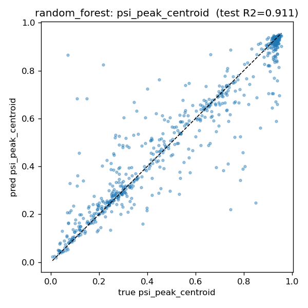

Classifier diagnostics (confusion matrix, and ROC / precision‑recall):

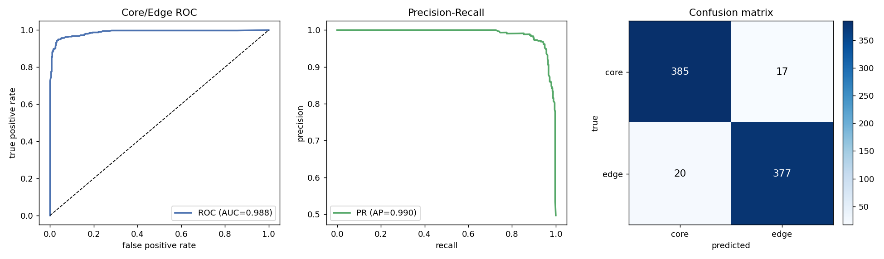

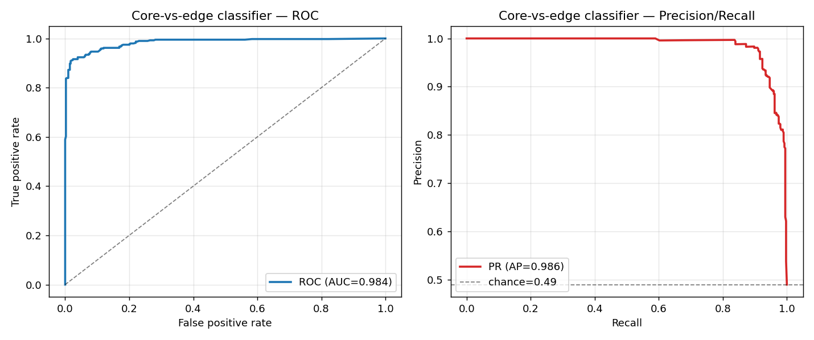

Examples of a clear **core** mode vs a clear **edge** mode (field + spectrum):

| Core mode | Edge mode |
|---|---|
| 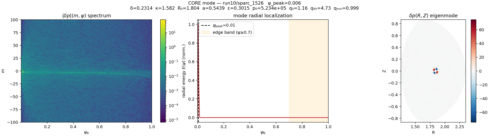 | 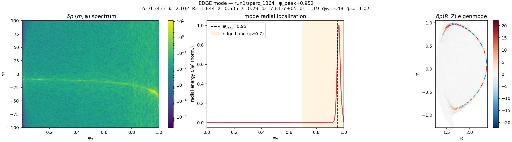 |

**Takeaway:** where the mode sits radially (and core‑vs‑edge) is **highly predictable
(R² ≈ 0.91 / 95 % acc / AUC 0.99)** from equilibrium scalars — a strong, deployable
result.

### 4.3 Eigenmode predictor — δp̂ spectrum image (FNO2D)

Predicts the entire `|δp̂|(m,ψ)` image per case, conditioned on equilibrium channels +
the `m − n·q(ψ)` resonance channel. Driver:
[`train_spectrum_image.py`](../../scripts/m3dc1/internal/train_spectrum_image.py).

#### The normalization breakthrough

The prior plateau (global val R² ≈ 0.60, **per‑case R² often negative**) was caused by
the arbitrary per‑case amplitude dominating the loss. Applying **per‑case max
normalization** (divide each spectrum by its own peak, then optionally `log10`) makes
the target the *shape only*. Result on the **full dataset**:

| Run | Target space | Best val R² |
|---|---|---:|
| `spectrum_image_full` (no norm) | log10 raw amplitude | 0.605 |
| `spectrum_image_full_maxnorm_raw` | max‑norm, linear | 0.786 |
| **`spectrum_image_full_maxnorm_log10`** | **max‑norm, log10** | **0.836** |
| `spectrum_image_2500_maxnorm_log10` | max‑norm, log10 (2.5k subset) | 0.831 |

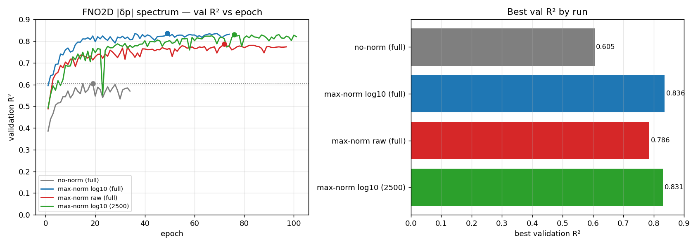

**Per‑case pattern R²** (best model, max‑norm log10), i.e. how well the *shape* of each
individual spectrum is recovered — the physically meaningful metric:

| Split | median | mean | R² > 0.5 | R² > 0.7 | p10 – p90 |
|---|---:|---:|---:|---:|---:|
| val (997) | **0.740** | 0.732 | 99 % | 73 % | 0.66 – 0.81 |
| test (1995) | **0.742** | 0.730 | 99 % | 73 % | 0.66 – 0.81 |

This is the key win: **essentially every case is now recovered with a positive,
useful per‑case R²**, versus the non‑normalized model where the median per‑case R² was
negative.

#### Best‑model per‑case comparisons

Validation examples spanning the R² range (columns: **ground truth / predicted /
difference**; each is `log10|δp̂|(m, ψ_N)`):

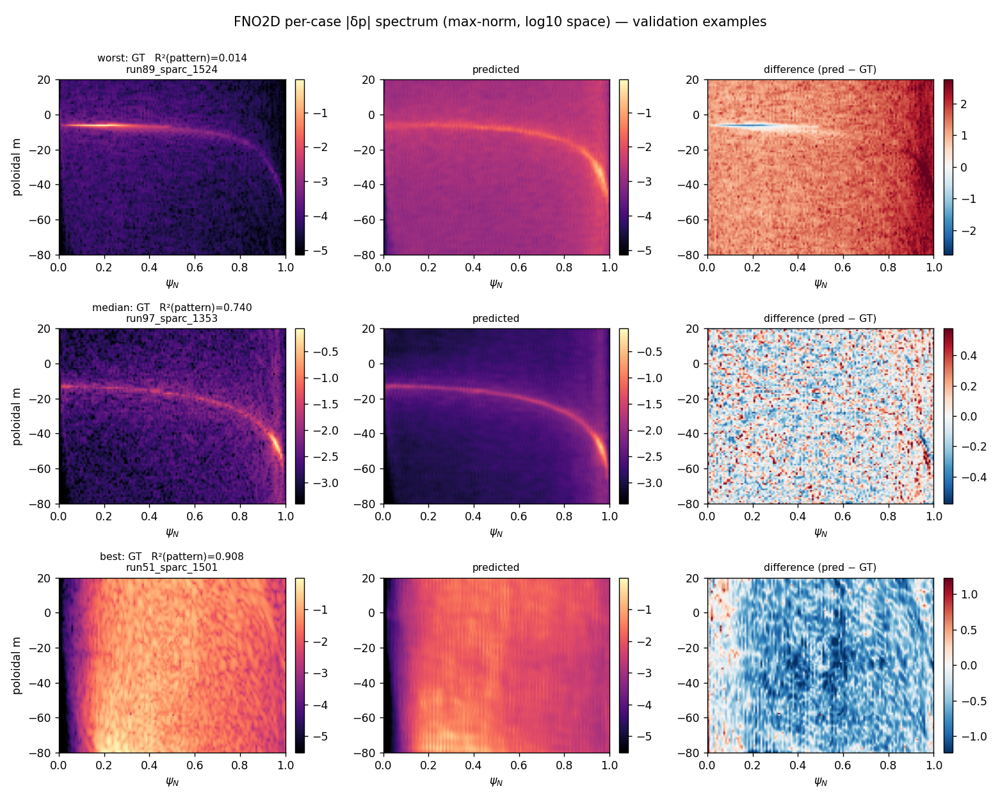

- **Best (R² = 0.91):** broad spectral envelope reproduced almost exactly.
- **Median (R² = 0.74):** the dominant `m` ridge vs ψ is captured; residual is noise‑floor.
- **Worst (R² = 0.01):** a very sharp, localized ridge — the model recovers the ridge
  location/shape but under‑resolves its sharpness; still no catastrophic failure.

#### Best‑model RZ field reconstruction

Because the eigenmode **phase** is not learnable, we reconstruct the field by combining
the model's **predicted magnitude** with the case's **true phase**, rescaled to the
physical peak, inverse‑FFT'd along `m`, and mapped onto the `fpy` PEST flux grid. Each
panel is 2×3 — **row 0 = spectrum `log10|δp̂|(m,ψ)`, row 1 = field `Re(δp)(R,Z)`**;
columns are **ground truth / prediction / difference**. Generated by
[`plot_case_field_recon.py`](../../scripts/m3dc1/internal/plot_case_field_recon.py).

_Best (pattern R² = 0.91) — core crescent envelope reproduced (amplitude slightly under‑predicted):_
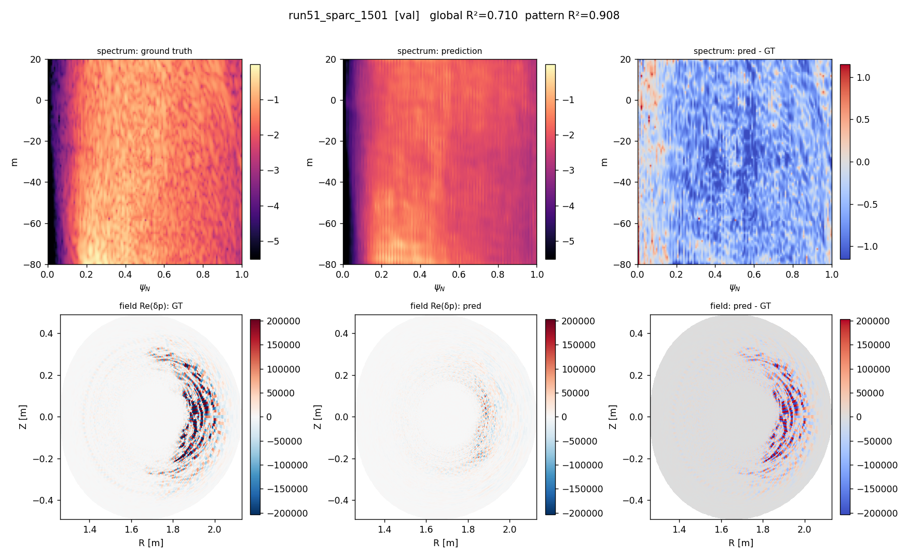

_Median (pattern R² = 0.74) — outboard **edge / ballooning** ridge captured in both spectrum and RZ location:_
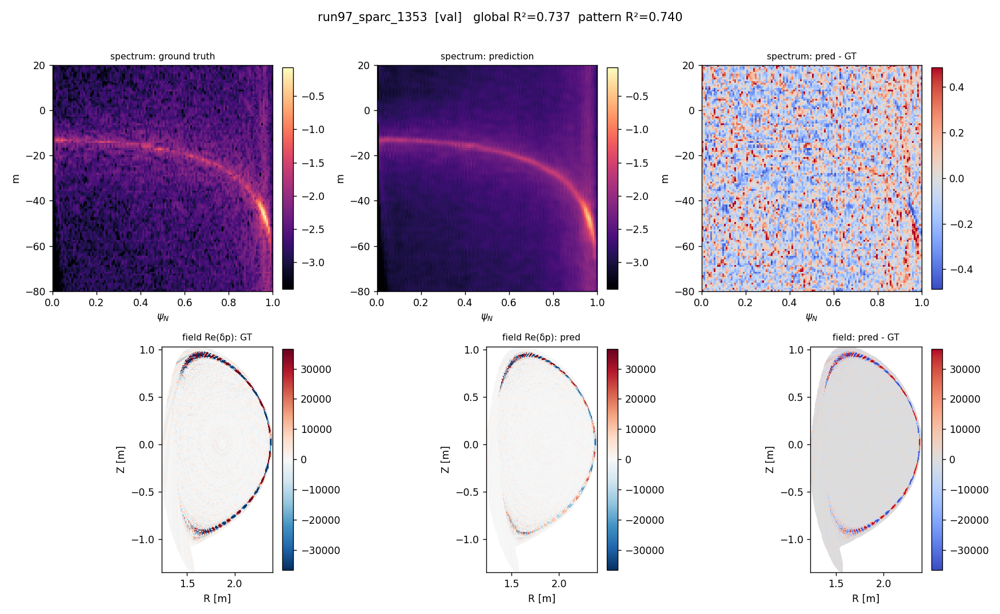

_Worst (pattern R² = 0.01) — the model **misplaces a compact core mode toward the edge**; the RZ view makes the failure obvious where the spectrum alone is ambiguous:_
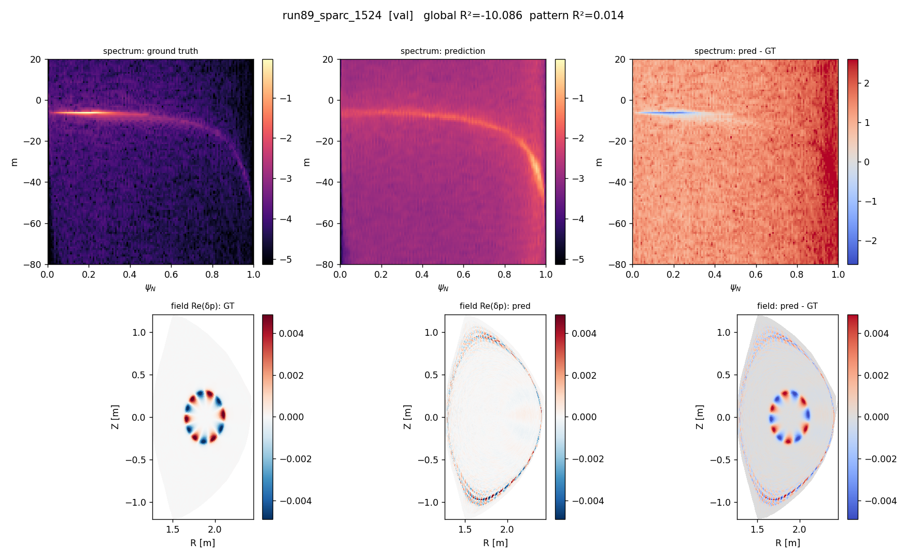

```bash
python scripts/m3dc1/internal/plot_case_field_recon.py \
    --run runs/spectrum_image_full_maxnorm_log10 --split val \
    --out-dir docs/m3dc1/assets --tag maxnorm_log10
```

#### Training curves (full dataset, GPU‑resident cache)

| Max‑norm **log10** (best) | Max‑norm **raw** |
|---|---|
| 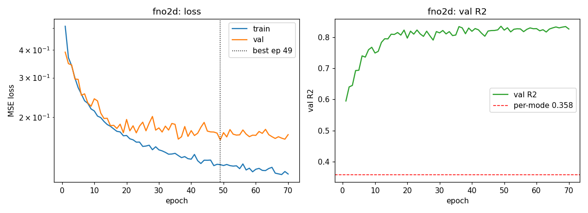 | 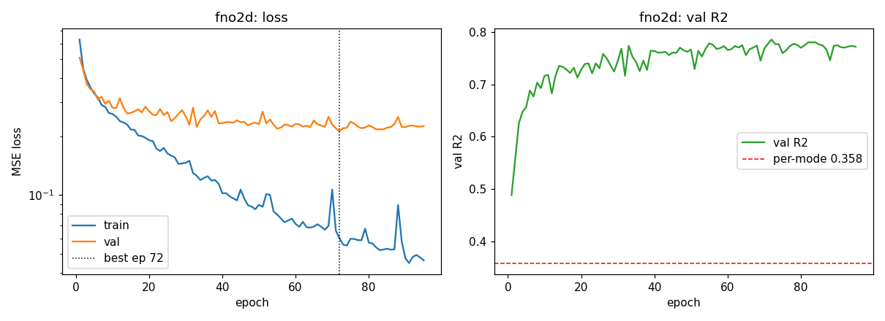 |

Non‑normalized full run (the plateau being broken):

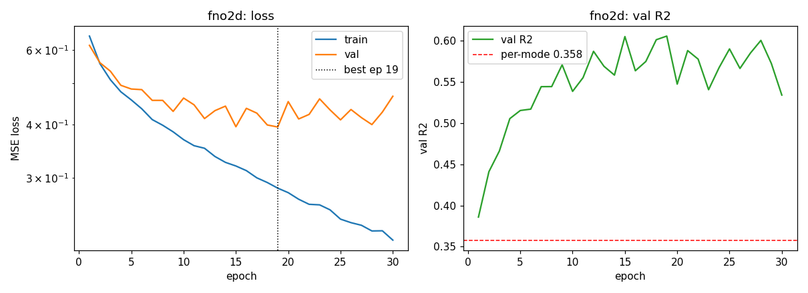

### 4.4 Pushing past 0.84 — target conditioning, quarantine, core balancing (2026‑07‑02)

Three orthogonal levers on the full dataset (FNO2D, 48 Fourier modes, composite
loss = pixel MSE + soft‑argmax peak‑location + marginal profiles), all evaluated on
GPU on the same held‑out test split:

| Run | Change vs previous | test global R² | test pattern R² |
|---|---|---:|---:|
| max‑norm log10 (2026‑07‑01 best) | — | 0.836 (val) | — |
| `spectrum_fno48_floor6_smooth1` | + target floor (−6 dex) + Gaussian smooth σ=1 | 0.905 | 0.920 |
| **`spectrum_fno48_floor6_smooth1_qc`** | + quarantine 2 corrupt cases | **0.9199** | **0.9238** |
| `spectrum_fno48_floor6_smooth1_qc_bal` | + core‑mode balancing (`--balance-psi`) | 0.9168 | 0.9206 |
| `spectrum_unet_floor6_smooth1` | U‑Net, same recipe | 0.891 | 0.896 |

**The levers (all in [`train_spectrum_image.py`](../../scripts/m3dc1/internal/train_spectrum_image.py)):**
- **Target flooring** (`--target-floor 6`): clip the max‑norm log10 target at −6 dex,
  deleting the ungradeable noise‑floor texture so R²/RMSE focus on the top 6 decades of
  amplitude that actually define the mode.
- **Target smoothing** (`--target-smooth 1`): Gaussian σ=1 denoise removes high‑frequency
  speckle while preserving the coherent ridge (the ~5 % incompressible noise that caps R²).
- **Quarantine** ([`scan_quality.py`](../../scripts/m3dc1/internal/scan_quality.py) →
  `--exclude-list`): a full scan of all **9,976** cases flagged only **2** empty‑spectrum /
  NaN‑γ cases (`run15_sparc_1416`, `run15_sparc_1417`); excluding them removes the
  pathological tail that single‑handedly moved the mean.
- **Core‑mode balancing** (`--balance-psi`): oversamples rare low‑ψ_N (core) peak bins via
  weighted resampling so core modes are seen ~as often as edge modes, without changing
  file sampling. Split persisted to `splits.json` so all evals use the identical held‑out set.

**Did balancing help?** On a shared test split, per peak‑ψ_N bin (core → edge):

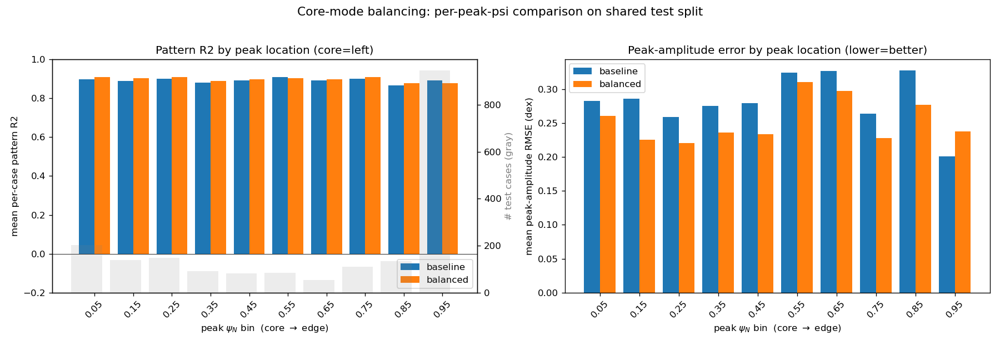

Core‑bin (ψ_N≈0.05) R² **0.897 → 0.908** and peak‑amplitude RMSE **0.247 → 0.244 dex**,
at a −0.003 aggregate R² cost (it gives back a little on the dominant edge bin). Balancing
improves exactly the two things aggregate R² hides — rare core modes and peak amplitude.

**Peak‑fidelity metrics now logged live** each epoch: `val_dpsi` (peak *location* error in
ψ_N) and `val_peak_rmse` (RMSE over the top‑1 % amplitude pixels, in dex). Best model:
**dpsi ≈ 0.05** (location ✓) but **peak RMSE ≈ 0.25 dex** (peak amplitude still ≈ 1.8× off —
the remaining lever; next: `--peak-weight`, less smoothing).

> **⚠️ Evaluate FNO models on GPU.** The FNO's FFT spectral convolutions produce ~0.05
> **lower** R² on CPU than the GPU the model trained on. All eval scripts
> (`eval_best_run.py`, `compare_balance.py`, `field_recon_compare.py`,
> `export_predictions_cache.py`) default to `--device cuda`.

#### What does pattern R² = 0.92 actually look like?

Distribution of per‑case pattern R² over the **1,994‑case test split**, plus a gallery of
cases sampled worst→best (p2 … p98). Generated by
[`metric_gallery.py`](../../scripts/m3dc1/internal/metric_gallery.py):

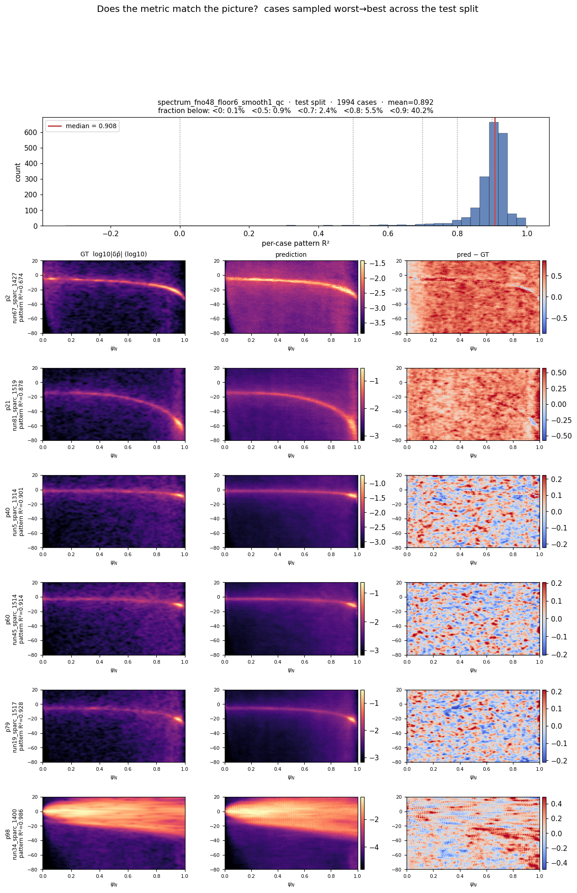

- **The distribution is tight and high:** median **0.908**, mean 0.892; only **0.9 %** of
  cases fall below R² 0.5 and **0.1 %** (2 cases) below 0. So "0.92" is not carried by a
  few easy cases — the *typical* case is well recovered.
- **The metric matches the picture — for the ridge.** Across the whole range, the coherent
  `m`‑ridge (the physically meaningful structure) is located and shaped correctly; the
  residual (`pred − GT`) is dominated by **noise‑floor texture**, not ridge error. Even the
  p2 worst case gets the ridge right and differs mainly in a systematic floor offset.
- **What it does *not* capture:** fine `m`‑structure and exact peak amplitude — precisely
  the things target‑smoothing (σ=1) trades away and that the field reconstruction below
  exposes. **Pattern R² measures spectral‑shape recovery; it over‑states field
  usefulness.** The field is the harder, more honest test.

Use this against the interactive explorer to gut‑check any model:
[`explore_mlm3dc1_predictions.ipynb`](../../m3dc1ml/notebooks/explore_mlm3dc1_predictions.ipynb)
now colors the parametric coverage map by `R2` / `pattern_R2` / `SSIM` / `NRMSE` and pops
a 2×3 (spectrum + field, GT/pred/diff) panel on tap, and carries a model‑comparison table
across all cached models.

Combined spectrum + field gallery (same cases, 6 panels per row):

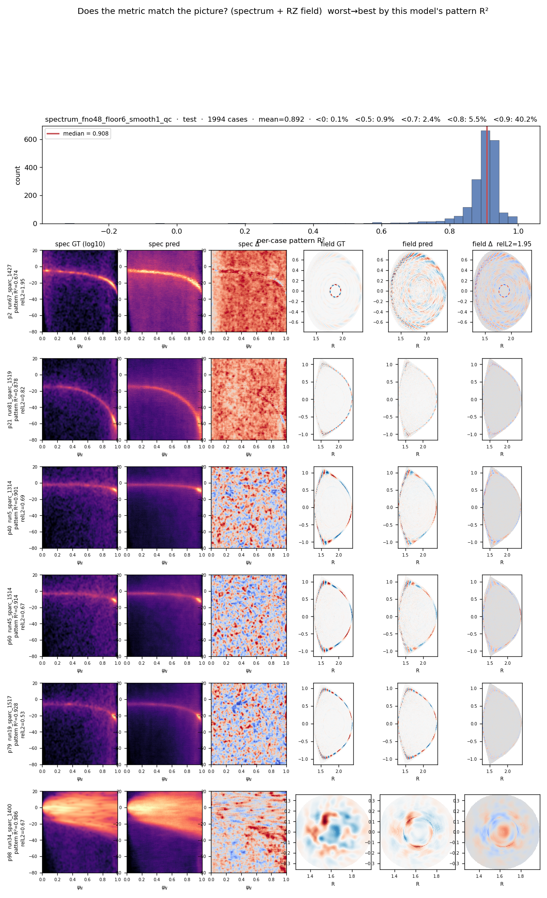

Field-only gallery (same cases):

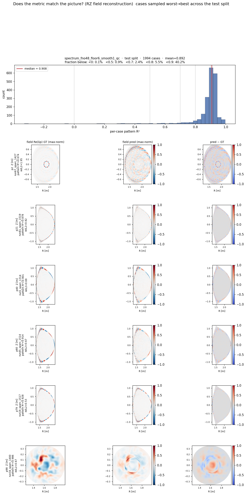

#### Eigenmode FIELD reconstruction — max‑normalized, ground truth vs predicted

The magnitude is what the surrogate learns; the **phase and absolute scale are unlearnable
per‑eigenmode gauges**, so the predicted `|δp̂|` is combined with the case's **true phase**,
inverse‑FFT'd along `m`, mapped onto the `fpy` PEST flux grid, and **each field is
max‑normalized to unit amplitude** for a pure shape comparison against the ground‑truth
data. Rows = worst / median / best test case; columns = true / predicted / difference
([`field_recon_compare.py`](../../scripts/m3dc1/internal/field_recon_compare.py)):

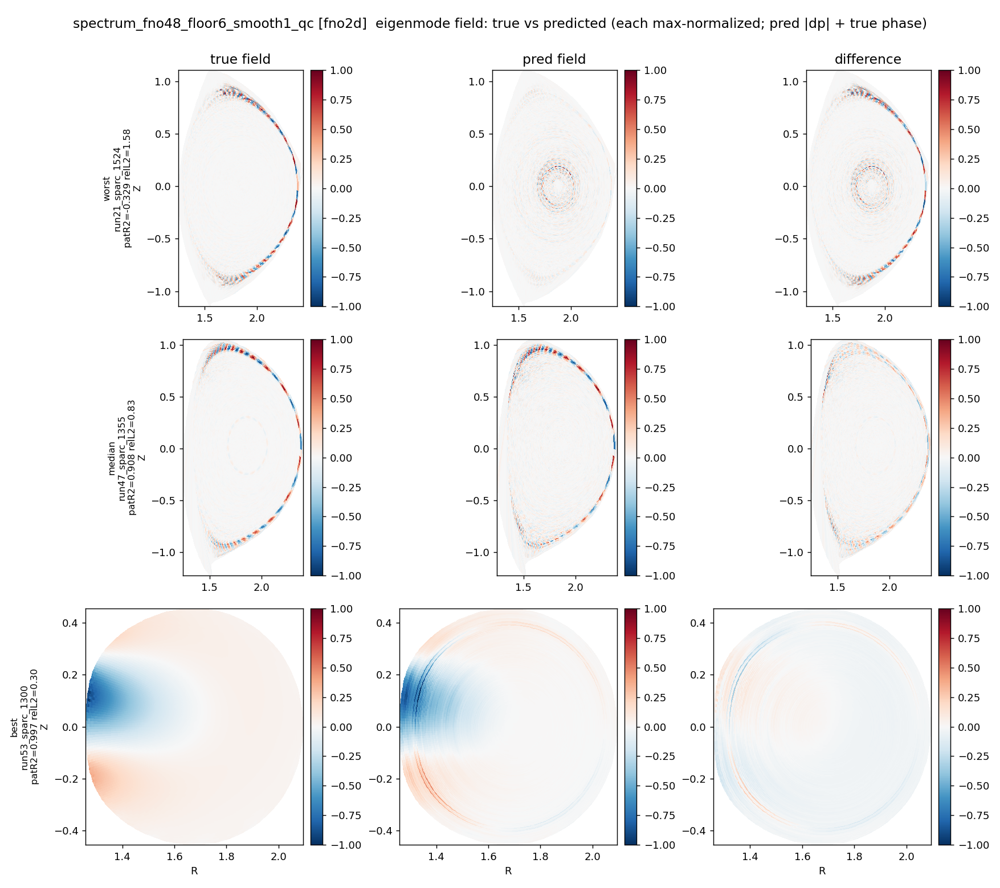

- **best** — a large‑scale **core** mode is reproduced almost exactly.
- **median** — an **edge/pedestal** mode: right location and rough structure, reduced fine detail.
- **worst** — a sharp **edge‑localized** mode collapses to ~0: under‑predicting/smoothing
  the thin edge ridge destroys the constructive interference that builds the localized field.
  This is the field‑space signature of the peak‑amplitude weakness above.

---

## 5. Tooling: how to run, monitor, resume, and validate

**Launch the spectrum surrogate (one command, handles `salloc`+`srun`):**
```bash
# fresh full-dataset run, max-norm log10
scripts/m3dc1/internal/spectrum_train.sh log10 fresh 120
# resume from the last checkpoint
scripts/m3dc1/internal/spectrum_train.sh log10 resume 120
```
Runbook: [`SPECTRUM_TRAINING_RUNBOOK.md`](SPECTRUM_TRAINING_RUNBOOK.md).

**Checkpoint policy & early stopping.** Every epoch writes `ckpt_<model>_last.pt`
(weights + optimizer state) for resume; `ckpt_<model>.pt` is overwritten whenever
**val loss beats the previous best**. Training early‑stops after `--patience` epochs
without improvement and then reloads the best checkpoint for final evaluation. Resume
with `--resume <ckpt>`.

**Monitor any run (stats report + loss curves):**
```bash
python -m surge.check_training --run runs/spectrum_image_full_maxnorm_log10
```
Writes `check_training_loss.png` and prints epochs, best/latest val loss & R², trend,
early‑stop status, and final test metrics.
([`surge/check_training.py`](../../surge/check_training.py))

**Export predictions for offline analysis:**
```bash
python scripts/m3dc1/internal/export_predictions_cache.py \
    --run runs/spectrum_image_full_maxnorm_log10 --model fno2d
```
Produces `predictions_cache.npz` (GT, pred, per‑case R², γ, ntor, metadata) consumed by
the curation notebook.
([`export_predictions_cache.py`](../../scripts/m3dc1/internal/export_predictions_cache.py))

**Interactively curate & validate predictions** (Bokeh/Panel: spectrum & field
comparison, stable/unstable check, and γ‑vs‑time convergence per case):
[`m3dc1ml/notebooks/curate_validate_mlm3dc1_predictions.ipynb`](../../m3dc1ml/notebooks/curate_validate_mlm3dc1_predictions.ipynb).

---

## 6. Summary — "what shows progress"

| Task | Best result | Status |
|---|---|---|
| Growth rate γ | **R² 0.87** (HPO torch_mlp) | ✅ strong |
| Core/edge mode locator | **R² 0.91 / 95 % acc / AUC 0.99** | ✅ strong |
| δp̂ spectrum image — global R² | **0.920** (FNO2D floor6+smooth1+quarantine) | ✅ 0.605 → 0.836 → **0.920** |
| δp̂ spectrum image — pattern R² | **0.924** (test) | ✅ |
| δp̂ spectrum image — core‑mode R² | **0.908** (w/ `--balance-psi`) | ✅ balancing helps rare modes |
| δp̂ peak amplitude (peak RMSE) | ≈ 0.25 dex (~1.8× off) | 🟡 remaining lever |
| δp̂ per‑mode magnitude (MLP) | R² 0.36 | 🟡 superseded by image model |
| Re(δp̂) | ≈ 0 | ❌ ill‑posed (use magnitude) |

**What moved the needle:** (1) per‑case max‑normalization (learn shape, not amplitude);
(2) target flooring + smoothing (drop the ungradeable noise floor); (3) quarantining the
2 corrupt cases; (4) core‑mode balancing for the rare low‑ψ_N modes.

**Known limitation — geometry is not an input.** Training happens entirely in `(m, ψ_N)`
spectral space. The model sees the `ψ_N` coordinate (so ψ_N=1 = LCFS), `q`/`p` profiles,
the `m−n·q` resonance, and shaping scalars (κ, δ, R0, a) — but **not** the real‑space
`ψ(R,Z)` flux map, edge flux‑surface compression, or the LCFS `(R,Z)` location. Edge‑
localized modes' sharpness/`m`‑broadening are set by exactly that edge geometry, which is
the population the model handles worst.

**Next steps:** (1) **add geometry channels** (magnetic shear `s=r q'/q`, flux expansion /
`|∇ψ|` at the edge, LCFS proximity) — most promising for the sharp edge modes and required
if we ever drop the "borrow true phase" reconstruction crutch; (2) attack peak amplitude
with `--peak-weight` and reduced smoothing (target peak RMSE < 0.2 dex so edge modes
survive the field reconstruction); (3) FNO+U‑Net ensemble; (4) physics‑residual target
(predict deviation from the `m ≈ n·q(ψ)` ridge prior); (5) correlate residual error with
`gs_error`/γ(t) convergence.
