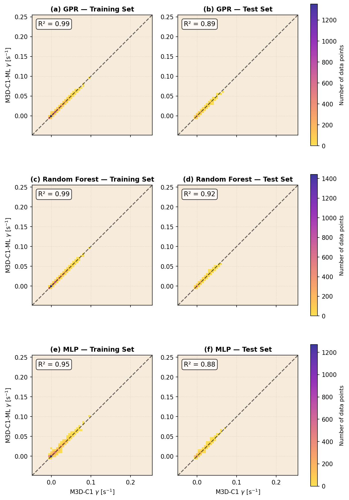
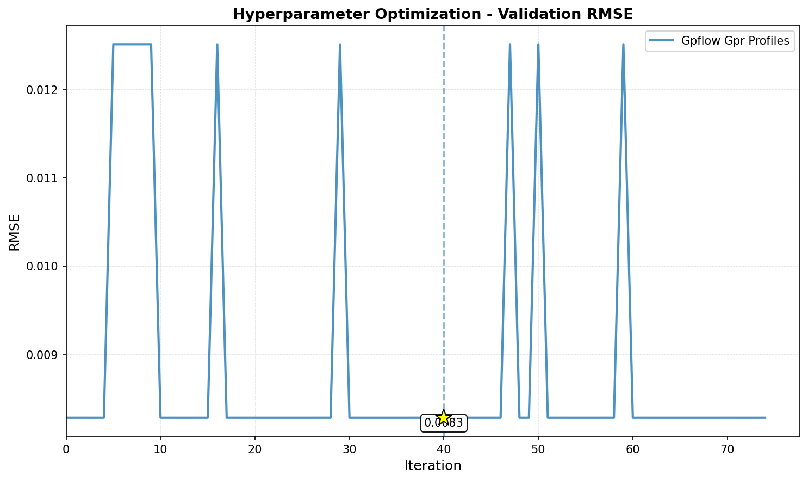
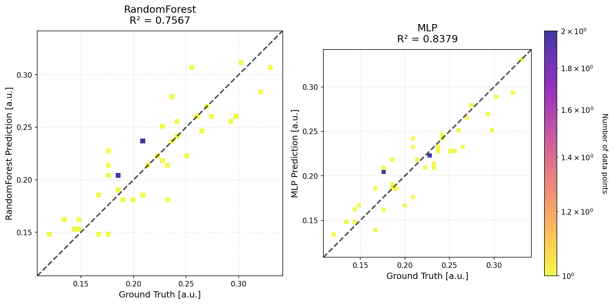
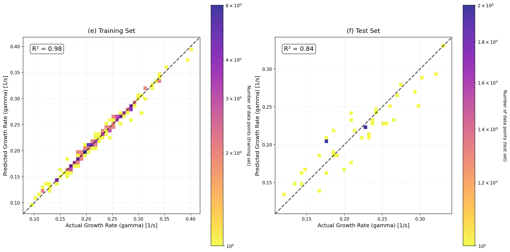
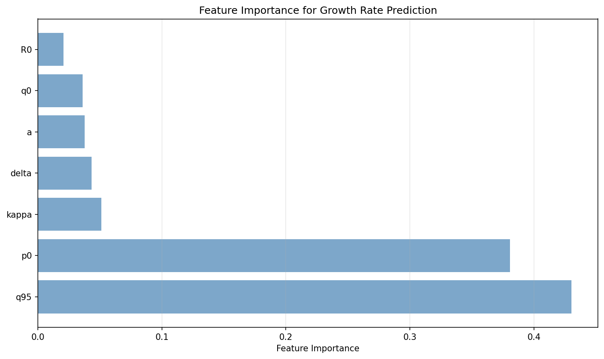
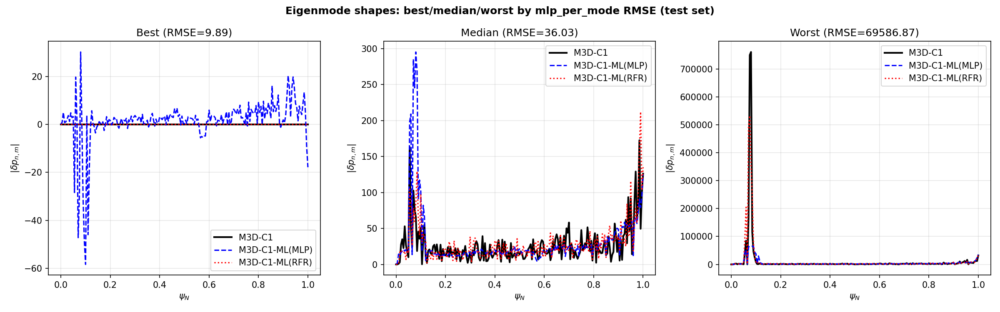
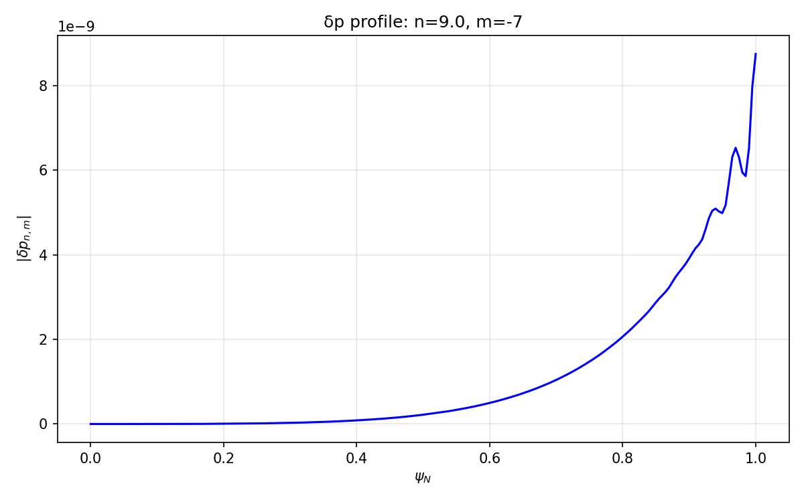

# M3DC1 surrogate results (summary)

This page pulls together **where artifacts live**, **what each training line is doing**, and **embedded figures** copied under `m3dc1/figures/` so they can live in git (the default `.gitignore` ignores `runs/` and most `*.png`).

**Related docs**

- Data layout and postprocessing status: [`docs/m3dc1/M3DC1_DATA_MAPPING.md`](../docs/m3dc1/M3DC1_DATA_MAPPING.md), [`docs/m3dc1/BATCH_DIRS_AND_DATA.md`](../docs/m3dc1/BATCH_DIRS_AND_DATA.md)
- Delta *p* spectra training: [`docs/m3dc1/DELTA_P_SPECTRA_TRAINING.md`](../docs/m3dc1/DELTA_P_SPECTRA_TRAINING.md)
- Per-mode δ*p*(ψ) guide: [`docs/m3dc1/DELTA_P_PER_MODE_GUIDE.md`](../docs/m3dc1/DELTA_P_PER_MODE_GUIDE.md)
- Development log for delta *p* tooling: [`docs/m3dc1/M3DC1_COMMITS_AND_SUMMARY.md`](../docs/m3dc1/M3DC1_COMMITS_AND_SUMMARY.md)

---

## What `M3DC1_DATA_MAPPING.md` is for

That file is **not** training output—it is an **inventory** of M3DC1 batch data on Perlmutter scratch (`/pscratch/sd/a/asvillar/mp288/jobs`):

- It records which run directories have **`sdata_pertfields_grid_complex_v2.h5`** (postprocessed δ*p* spectra) vs only raw **`C1.h5`**.
- **Current state:** only **`batch_16/run1`** has been postprocessed (31 `sparc_*` cases with `complex_v2`). Everything else with raw data still needs the postprocessing step before you can train on thousands of δ*p* spectra rows.

So **M3DC1 “training”** in SURGE is: load inputs/metadata from those HDF5-derived pickles or directly from batch dirs (`dataset_source: m3dc1_batch` / `m3dc1_batch_per_mode`), then run the standard workflow (`surge.cli` / `run_surrogate_workflow`).

---

## Where the latest numerical results are (local machine)

Run outputs are written under **`runs/<run_tag>/`** (gitignored). On the workspace used to build this page, these directories existed:

| Run tag | Target | Config (repo) | Notes |
|---------|--------|---------------|--------|
| **`m3dc1_aug_r75`** | **`output_gamma`** (growth rate), SPARC M3DC1 D1 | [`configs/m3dc1_aug_r75.yaml`](../configs/m3dc1_aug_r75.yaml) | Full-size study (9981 rows after `sample_rows`, 75 HPO trials / model). **Primary “production” γ surrogate.** |
| **`m3dc1_demo`** | **`output_gamma`**, smaller demo | [`configs/m3dc1_demo.yaml`](../configs/m3dc1_demo.yaml) | Includes RF / MLP / GPR; quick plots. |
| **`m3dc1_delta_p_batch16`** | Full δ*p* spectrum (many outputs), ~30 cases | [`configs/m3dc1_delta_p_batch16.yaml`](../configs/m3dc1_delta_p_batch16.yaml) | High dimensional; metrics poor (expected at *n*≈30). |
| **`m3dc1_delta_p_profile_mode0`** | Single-mode profile | [`configs/m3dc1_delta_p_profile_mode0.yaml`](../configs/m3dc1_delta_p_profile_mode0.yaml) | Still *n*≈30; severe overfit / bad test. |
| **`m3dc1_delta_p_per_mode`** | Rows = (case, *n*, *m*) → profile | [`configs/m3dc1_delta_p_per_mode.yaml`](../configs/m3dc1_delta_p_per_mode.yaml) | 6000 rows in summary. |
| **`m3dc1_delta_p_per_mode_hpo`** | Same family with HPO | [`configs/m3dc1_delta_p_per_mode_hpo.yaml`](../configs/m3dc1_delta_p_per_mode_hpo.yaml) | Produces `plots/eigenmode_best_worst.png`. |
| **`m3dc1_per_mode_from_batch`** | Load per-mode directly from batch dir | [`configs/m3dc1_delta_p_per_mode_from_batch.yaml`](../configs/m3dc1_delta_p_per_mode_from_batch.yaml) | Similar metrics to pickle-based per-mode. |

For any run: see **`metrics.json`**, **`workflow_summary.json`**, **`predictions/*.csv`**, **`models/*.joblib`**, and optional **`plots/`**.

---

## Growth-rate (γ) surrogates — metrics snapshot

Values from `runs/m3dc1_aug_r75/metrics.json` (scalar **`output_gamma`**; test fraction 0.2):

| Model | Test R² | Test RMSE | Test MAE |
|-------|---------|-----------|----------|
| `random_forest_profiles` | 0.919 | 0.00613 | 0.00207 |
| `torch_mlp_mc_dropout` | 0.884 | 0.00733 | 0.00322 |
| `gpflow_gpr_profiles` | 0.885 | 0.00729 | 0.00288 |

**Note:** `runs/m3dc1_aug_r75/performance_summary.md` documents HPO winners and states GPflow did not complete in some rebuilds—check `models/` and `hpo/` for your local copy.

Smaller reference run **`m3dc1_demo`** (`metrics.json`): RF test R² ≈ **0.854**, MLP test R² ≈ **0.853** (subset / different spec).

### γ — figures

**Full study — prediction grid and HPO**

**Demo run — model comparison, RF parity plot, feature importance**

---

## Delta *p* surrogates — metrics snapshot

### Full spectrum (`m3dc1_delta_p_batch16`)

From `runs/m3dc1_delta_p_batch16/metrics.json` (~2500 outputs, ~30 samples):

| Model | Test R² |
|-------|---------|
| `rf_delta_p` | −76.8 |
| `mlp_delta_p` | −17.3 |

Interpretation: **severely underdetermined**; documented expectation in [`docs/m3dc1/M3DC1_COMMITS_AND_SUMMARY.md`](../docs/m3dc1/M3DC1_COMMITS_AND_SUMMARY.md).

### Single-mode profile — mode 0 (`m3dc1_delta_p_profile_mode0`)

| Model | Test R² |
|-------|---------|
| `rf_profile_mode0` | −104.4 |
| `mlp_profile_mode0` | −23.8 |

### Per-mode dataset (`m3dc1_delta_p_per_mode`)

| Model | Test R² | Test RMSE |
|-------|---------|-----------|
| `rf_per_mode` | 0.505 | 1901 |
| `mlp_per_mode` | 0.530 | 2822 |

(Scale of RMSE reflects δ*p* amplitude units in the pickle.)

### Per-mode with HPO (`m3dc1_delta_p_per_mode_hpo`)

| Model | Test R² | Test RMSE |
|-------|---------|-----------|
| `rf_per_mode` | 0.348 | 1647 |
| `mlp_per_mode` | 0.492 | 2730 |

### δ*p* — figures

**Best/worst eigenmode-style comparison (HPO run)**

**Example δ*p*(ψ) profile for (*n*, *m*) = (9, −7)** — from `scripts/m3dc1/plot_profile.py` workflow (`runs/delta_p_n9_m-7.png` copy):

---

## Regenerating figures

- γ visualization helper: `python examples/viz_m3dc1_predictions.py --run-dir runs/m3dc1_aug_r75` (see [`docs/dev/UNSTAGED_CHANGES_SUMMARY.md`](../docs/dev/UNSTAGED_CHANGES_SUMMARY.md) if the script path differs on your branch).
- δ*p* profile plot: `python scripts/m3dc1/plot_profile.py data/datasets/SPARC/delta_p_per_mode.pkl --n 9 --m -7`
- Best/worst plot script: `scripts/m3dc1/plot_best_worst_eigenmode.py` (used for the HPO run plots directory).

---

*Generated as a consolidation of repo docs and local `runs/` metrics; re-copy `m3dc1/figures/` after new training if you want this page to stay visually in sync.*
